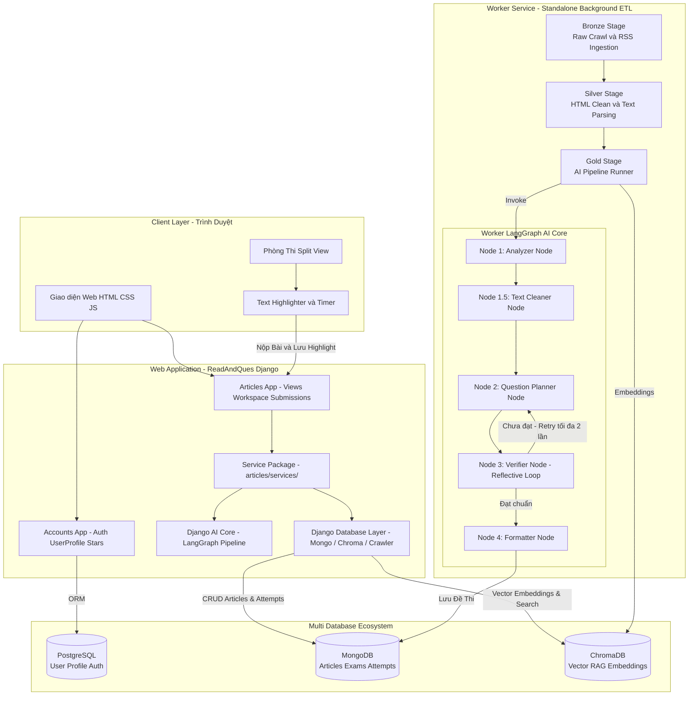
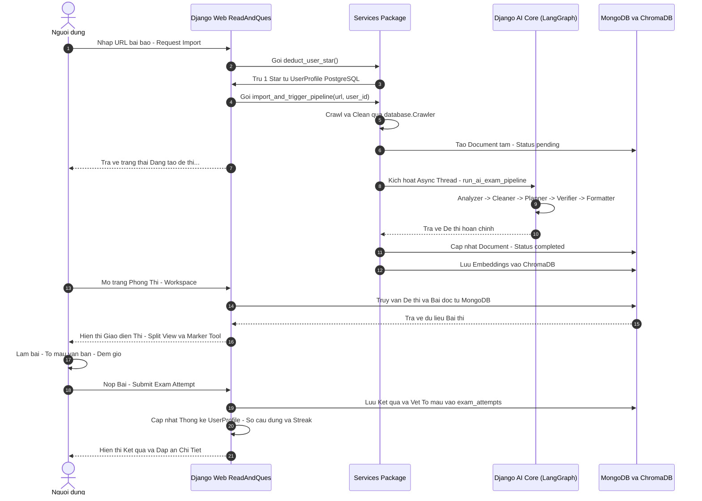

# 🏗️ Kiến Trúc & Cấu Trúc Tổng Thể Dự Án ReadAndQues

Dự án này, về mặt cơ bản là trang web giúp người dùng luyện đọc tiếng anh dựa trên các nguồn tài liệu có sẵn trên internet, bằng cách sử dụng các mô hình ngôn ngữ AI (LLM) để có thể hiểu nội dung các nguồn tài liệu và sinh ra quiz tương ứng.

Hiện tại thì (mặc dù giao diện nó để là IELTS) nhưng trang web này hướng đến việc luyện đọc tiếng anh nói chung, (sau này sẽ sửa lại front end cho phù hợp)


ĐỂ CHẠY PROJECT NÀY:
1. dựng docker compose lên.
2. kích hoạt venv hiện tại lên (nhớ cài đặt toàn bộ các package)
3. nhớ thêm các biến môi trường còn thiếu trong file .env
4. chạy lệnh sau để  chạy server lên

```python
python <đường dẫn tới file manage.py> runserver 
```
5. quan sát terminal, truy cập đường dẫn bên trong.

---

## 📌 1. Tổng Quan Kiến Trúc Hệ Thống

Hệ thống được thiết kế theo mô hình **Decoupled Modular Architecture** gồm 2 khối chính và hệ sinh thái 3 cơ sở dữ liệu chuyên biệt:

1. **`ReadAndQues` (Django Web Application)**:
   - Đảm nhận toàn bộ logic liên quan đến người dùng, quản lý tài liệu, giao diện làm trắc nghiệm,...
2. **`worker_service` (ETL Data Pipeline & AI Engine)**:
   - **Data Pipeline**: Bên trong là logic để ingest dữ liệu (theo ngày) để batch import các bài viết mới nhất
   - **AI Core (LangGraph)**: Pipeline AI 4-Node tự động phân tích cú pháp/ngữ nghĩa bài đọc, sinh các bộ câu hỏi đa dạng dạng bài (Yes/No/Not Given, Fill-in-the-blanks, Multiple Choice) và tự kiểm định độ chính xác (Self-Verifier). Về tương lai thì lớp này có thể được cập nhật lại để sử dụng tính năng xử lý batch trên OpenAI cho đỡ tốn token.

---

## 🔄 2. Sơ Đồ Kiến Trúc Hệ Thống (System Architecture)



---

## 📁 3. Thư Mục Dự Án (Project Tree & Explanation)

Cấu trúc thư mục được sắp xếp mô-đun hóa cao, tách biệt độc lập giữa ứng dụng web Django và dịch vụ xử lý ngầm (Worker Service):

```text
ReadandQues/
├── docker-compose.yaml         # Cấu hình container: MongoDB (27017), Postgres (5432), ChromaDB (8002)
├── pyproject.toml / uv.lock    # Quản lý dependency dự án bằng UV / Python
├── requirements.txt            # Danh sách thư viện cần thiết
├── run.sh                      # Script khởi chạy nhanh hệ thống
│
├── ReadAndQues/                # 🌐 DJANGO WEB CORE APPLICATION (Standalone)
│   ├── accounts/               # Mô-đun quản lý người dùng, đăng nhập, đăng ký, xác thực Email
│   │   ├── models.py           # UserProfile (Lưu Stars, Thống kê làm bài, Streak, Avatar)
│   │   ├── backends.py         # Custom Email/Username Authentication Backend
│   │   └── templates/          # HTML Templates (login, profile, register, verify)
│   │
│   ├── articles/               # Mô-đun quản lý bài báo và giao diện làm trắc nghiệm
│   │   ├── models.py           # Document wrappers & Pydantic Validation (Article, Quiz, Attempt)
│   │   ├── services/           # 📦 Gói dịch vụ mô-đun hóa (user_stars, ingestion, cleaning, exam_generation, pipeline_orchestrator)
│   │   ├── views.py            # Xử lý Request/Response (import, workspace, all_tests, submission)
│   │   └── templates/          # Giao diện chính (workspace.html, detail.html, all_tests.html)
│   │
│   ├── AI_core/                # 🤖 MẠNG LƯỚI AI AGENT ĐỘC LẬP NỘI BỘ DJANGO
│   │   ├── config.py           # Cấu hình LLM (Azure OpenAI / Gemini / OpenAI) & ExamConfig
│   │   ├── graph.py            # Sơ đồ LangGraph 4-Node (Analyzer -> Text Cleaner -> Planner -> Verifier -> Formatter)
│   │   ├── prompts.py          # Prompt Templates chuyên biệt cho IELTS Reading
│   │   └── schemas.py          # Pydantic models (SemanticAnalysis, QuizItem, TokenUsageLog, etc.)

│   │
│   ├── database/               # 🗄️ TẦNG TRƯU TƯỢNG HÓA DATABASE & CRAWLER NỘI BỘ WEBSITE
│   │   ├── Mongo/              # Connection & CRUD operations cho MongoDB (Articles, Attempts)
│   │   ├── Chroma/             # Connection & Vector Search operations cho ChromaDB
│   │   └── Crawler/            # Scraper (newspaper3k) & Formatter (to_markdown)
│   │
│   └── ReadAndQues/            # Settings, URLs & WSGI/ASGI Config của Django
│
├── worker_service/             # ⚙️ BACKGROUND DATA PIPELINE & AI ENGINE (Standalone Container Service)
│   ├── database/               # 🗄️ TẦNG TRƯU TƯỢNG HÓA CƠ SỞ DỮ LIỆU & CRAWLER
│   │   ├── Mongo/              # Connection & CRUD operations cho MongoDB (Bronze, Silver, Gold, Logs, Attempts)
│   │   ├── Chroma/             # Connection & Vector Search operations cho ChromaDB
│   │   └── Crawler/            # Scraper (newspaper3k) & Formatter (to_markdown)
│   │
│   ├── data_pipeline/          # Xử lý dữ liệu đa tầng (Medallion ETL)
│   │   ├── bronze_batch.py     # Crawl hàng loạt từ RSS Feeds
│   │   ├── bronze_one.py       # Crawl đơn lẻ 1 bài báo từ URL người dùng nhập
│   │   ├── silver.py           # Phân tách văn bản, lọc loại bỏ HTML rác, validate độ dài
│   │   └── gold.py             # Gọi AI Core sinh đề thi, lưu trữ MongoDB & ChromaDB
│   │
│   └── ai_core/                # 🤖 MẠNG LƯỚI AI AGENT (LANGGRAPH PIPELINE WORKER)
│       ├── config.py           # Cấu hình LLM (Azure OpenAI / Gemini / OpenAI), ExamConfig
│       ├── graph.py            # LangGraph StateGraph (Analyzer -> Planner -> Verifier -> Formatter)
│       ├── prompts.py          # Prompt Templates chuyên biệt cho IELTS Reading
│       └── schemas.py          # Structural Pydantic models (SemanticAnalysis, ExamOutput)
│
└── docs/                       # 📚 TÀI LIỆU DỰ ÁN (DOCUMENTATION)
    ├── 01_project_structure.md # Tổng quan kiến trúc & sơ đồ hệ thống
    ├── 02_ReadAndQues.md        # Chi tiết Django Web App, Services, AI_core & Marker Tool
    └── 03_worker_service.md    # Chi tiết Medallion Pipeline, LangGraph AI Core & Database Layer
```

---

## 🗃️ 4. Hệ Sinh Thái 3 Cơ Sở Dữ Liệu (Multi-Database Strategy)

Dự án áp dụng mô hình **Polyglot Persistence** (sử dụng nhiều loại cơ sở dữ liệu cho đúng mục đích chuyên biệt):

| Cơ sở dữ liệu | Loại DB | Dữ liệu lưu trữ chính | Lý do lựa chọn |
| :--- | :--- | :--- | :--- |
| **PostgreSQL** | Relational DB (SQL) | `User`, `UserProfile`, `EmailVerification`, `Stars`, Thống kê người dùng. | Đảm bảo tính toàn vẹn dữ liệu (ACID), bảo mật tài khoản, quan hệ 1-1 chặt chẽ với Django Auth. |
| **MongoDB** | Document DB (NoSQL) | `articles` (bài đọc), `exams` (đề thi dạng JSON lồng ghép), `exam_attempts` (lịch sử làm bài + vết highlight). | Linh hoạt cấu trúc JSON lồng phức tạp của đề thi IELTS và lưu trữ vết đánh dấu văn bản (Highlighter). |
| **ChromaDB** | Vector DB | Vector Embeddings tóm tắt bài đọc & metadata. | Hỗ trợ tìm kiếm bài đọc tương quan theo ngữ nghĩa (Semantic RAG Search) cho trang bài viết liên quan. |

---

## 🔀 5. Luồng Dữ Liệu End-to-End (Data Flow Sequence)

Sơ đồ thể hiện quy trình từ lúc Người dùng nhập 1 URL bài báo ➔ Crawl ➔ AI sinh đề ➔ Thi thử ➔ Chấm điểm & Lưu vết:




---

## 🛠️ 6. Bảng Tóm Tắt Công Nghệ (Tech Stack)

* **Backend Web Core**: Python 3.13, Django 5.x, Pydantic v2.
* **Worker & AI Core**: LangGraph, LangChain, Google Gemini API / OpenAI GPT-4o.
* **Vector & Embedding**: ChromaDB Client, Sentence-Transformers / OpenAI Embeddings.
* **Databases**: PostgreSQL 15, MongoDB 7, Mongo-Express (Web GUI).
* **Frontend**: HTML5, Vanilla CSS (Design System hiện đại, Responsive Glassmorphism), Modern JavaScript (ES6+), Inter Font, Custom Marker Engine.