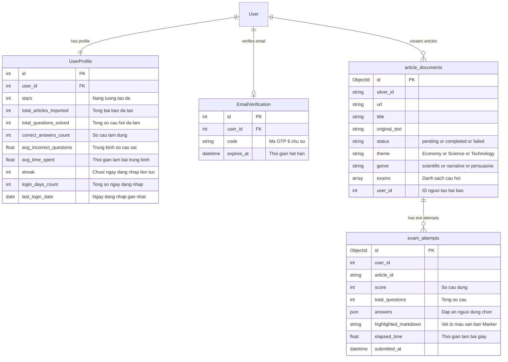
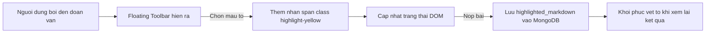
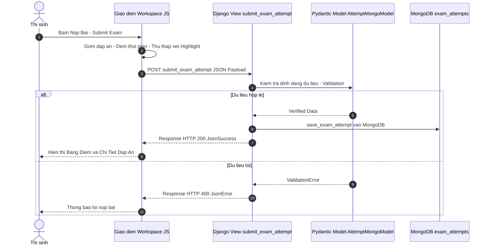

# 🌐 Django Web Application (`ReadAndQues`) Documentation

Ứng dụng web **`ReadAndQues`** đóng vai trò là tầng giao diện (Frontend UI) và trung tâm quản lý tài khoản, phòng thi IELTS, lịch sử làm bài và điều phối kết nối với cơ sở dữ liệu.

---

## 📌 1. Kiến Trúc Ứng Dụng Django

Hệ thống được chia thành 2 ứng dụng Django chính:

1. **`accounts` App**: Quản lý người dùng, đăng ký/đăng nhập, xác thực email, quản lý hệ thống năng lượng **Star System** và lưu trữ lịch sử/thống kê học tập.
2. **`articles` App**: Quản lý việc nhập bài báo (Import), hiển thị danh sách bài thi (All Tests), logic làm bài trắc nghiệm (Quiz Interface).

---

## 🗄️ 2. Mô Hình Dữ Liệu (ER Diagram & Databases)

Hệ thống kết hợp dữ liệu có cấu trúc trên **PostgreSQL** (thông qua Django ORM) và dữ liệu phi cấu trúc phong phú trên **MongoDB**.

---

## 🔑 3. Mô-đun Quản Lý Tài Khoản (`accounts`)

### 3.1. Hệ Thống Star System (Năng Lượng Tạo Đề)
- Khi người dùng tạo tài khoản mới, hệ thống tự động khởi tạo **`UserProfile`** với số lượng **Stars** ban đầu (10 Stars ở môi trường Production, 100 Stars ở môi trường DEBUG).
- **Quy tắc trừ/hoàn Star**:
  - Khi bắt đầu nhập 1 URL bài báo ➔ Trừ **1 Star** atomic (`deduct_user_star`).
  - Nếu quá trình crawl/clean dữ liệu thất bại ➔ Hoàn trả **1 Star** atomic (`refund_user_star`).

### 3.2. Theo Dõi Chuỗi Đăng Nhập & Thống Kê
- Hệ thống sử dụng **Django Signals** (`@receiver(user_logged_in)`) để tự động kiểm tra ngày đăng nhập:
  - Cập nhật `last_login_date` và tăng `login_days_count` nếu là ngày mới.
  - Thống kê tỷ lệ câu đúng/sai, số bài báo đã import và tổng thời gian rèn luyện hiển thị trên trang Profile cá nhân.

---

## 📰 4. Mô-đun Bài Báo & Phòng Thi (`articles`)

### 4.1. Tầng Dịch Vụ Mô-đun Hóa - Service Package (`articles/services/`)
Mọi logic kinh doanh được tách biệt khỏi `views.py` thành gói dịch vụ mô-đun hóa với từng file đảm nhận nhiệm vụ đơn lẻ, độc lập hoàn toàn với `worker_service`:

- **`user_stars.py`**:
  - `deduct_user_star(user)`: Trừ Star atomic với `transaction.atomic()` và `select_for_update()` chống Race Condition.
  - `refund_user_star(user)`: Hoàn trả Star khi luồng xử lý thất bại.
- **`ingestion.py`**:
  - `ingest_article_content(url)`: Cào dữ liệu bài báo từ URL qua `ReadAndQues.database.Crawler.scraper`.
- **`cleaning.py`**:
  - `clean_and_validate_article(crawl_result)`: Kiểm tra độ dài bài viết (500 - 4000 từ) và định dạng văn bản qua `ReadAndQues.database.Crawler.formatter`.
- **`exam_generation.py`**:
  - `run_ai_exam_pipeline(original_text)`: Gọi LangGraph AI engine nội bộ từ `ReadAndQues.AI_core.graph`.
  - `generate_exam_for_article_async(article_id, ...)`: Chạy ngầm AI sinh đề, cập nhật MongoDB (`ReadAndQues.database.Mongo`) và lưu vector embedding vào ChromaDB (`ReadAndQues.database.Chroma`).
- **`pipeline_orchestrator.py`**:
  - `import_and_trigger_pipeline(url, user_id)`: Tổng hợp luồng đồng bộ Ingest ➔ Clean ➔ Lưu MongoDB Pending ➔ Khởi chạy Background Thread sinh đề thi ngầm.

### 4.2. Tầng AI Engine Độc Lập (`ReadAndQues/AI_core`)
Ứng dụng Django được trang bị khối `AI_core` riêng biệt hoàn toàn:
- **`config.py`**: Cấu hình kết nối LLM (Azure OpenAI) và tính toán số câu hỏi thông qua `ExamConfig`.
- **`schemas.py`**: Định nghĩa chuẩn toàn bộ Pydantic Models (`SemanticAnalysis`, `QuizItem`, `TokenUsageLog`, `GraphState`).
- **`prompts.py`**: Tập hợp các câu lệnh Prompt chuẩn hóa cho Analyzer, Question Planner và Verifier.
- **`graph.py`**: Sơ đồ thực thi LangGraph 4-node (`analyzer` ➔ `text_cleaner` ➔ `question_planner` ➔ `verifier` ➔ `formatter`).

### 4.3. Tầng Trừu Tượng Hóa Cơ Sở Dữ Liệu (`ReadAndQues/database`)
Gói `database/` nội bộ ứng dụng Django chịu trách nhiệm cung cấp giao tiếp trực tiếp với MongoDB, ChromaDB và công cụ cào tin tức:
- **`Mongo/`**:
  - `connection.py`: Khởi tạo MongoClient kết nối tới MongoDB.
  - `crud.py`: Phương thức `insert_article_document`, `update_article_document`, `get_article_document_by_id`, `get_completed_articles` và `save_exam_attempt`.
- **`Chroma/`**:
  - `connection.py`: HttpClient kết nối ChromaDB container (port 8002).
  - `operations.py`: Thêm vector tóm tắt `add_article_vector` và gợi ý bài thi tương quan `get_related_articles_via_chroma`.
- **`Crawler/`**:
  - `scraper.py`: Cào dữ liệu bài viết qua Newspaper3k (`crawl_article_content`).
  - `formatter.py`: Chuẩn hóa văn bản sang định dạng Markdown chuẩn (`to_markdown`).

### 4.4. Giao Diện & Endpoints Chính (`views.py`)

| Endpoint URL | HTTP Method | Chức năng |
| :--- | :--- | :--- |
| `/articles/import/` | `GET / POST` | Trang nhập URL bài báo. Hỗ trợ AJAX request hiển thị tiến trình tức thì. |
| `/articles/status/<pk>/` | `GET` | Polling API để Frontend kiểm tra trạng thái sinh đề (`pending` ➔ `completed`). |
| `/articles/all/` | `GET` | Danh sách toàn bộ bài thi công khai, hỗ trợ Lọc theo **Theme** (Kinh tế, Khoa học...) & **Genre**, Phân trang (`Paginator`). |
| `/articles/<pk>/` | `GET` | Trang chi tiết/phòng thi bài đọc. Mọi người dùng đều có thể làm các bài thi ở trạng thái `completed`. |
| `/articles/submit/<pk>/` | `POST` | API nhận kết quả nộp bài thi (POST JSON), validate dữ liệu bằng Pydantic và lưu vào MongoDB. |

---

## 🎨 5. Workspace đọc bài và câu hỏi

Giao diện **Đọc và làm bài** được thiết kế tối ưu hóa trải nghiệm làm bài thực tế:

### 5.1. Thiết Kế Chia Đôi Màn Hình (Split Screen Layout)
- **Cột trái**: Hiển thị bài đọc đã được lấy thành công.
- **Cột phải**: Danh sách câu hỏi chia theo các dạng bài chuẩn (YNNG, FIB, MCQ) cùng Đồng hồ đếm giờ (Stopwatch/Timer).

### 5.2. Toolbox cho làm bài
Hiện tại có thiết kế một hộp toolbox để sau này phát triển các tính năng AI trên đây.
Tính năng duy nhất hiện mới phát triển xong mà marker -> cho phép người dùng highlight trong lúc làm bài thi -> lưu các vết hightlight lại
Các vết highlight này sau này sẽ được trưng dụng lại để làm gợi ý học tập (chưa phát triển tới)
- **Hoạt động**: Khi người dùng bôi đen đoạn văn bản bên cột bài đọc, một Toolbar nổi (Floating Toolbar) xuất hiện cho phép chọn màu tô (Vàng, Xanh Lá, Hồng) hoặc Xóa vết tô.
- **Đồng bộ vết tô**: Khi bấm **Nộp bài (Submit)**, toàn bộ cấu trúc vết tô màu (Highlighter Markdown) được đóng gói và gửi kèm về API `submit_exam_attempt`.
- **Xem lại lịch sử**: Khi người dùng mở lại lịch sử các lần làm bài trước, bài đọc sẽ phục hồi chính xác các vị trí từ ngữ đã được tô màu.

---

## 🔄 6. Luồng Xử Lý Nộp Bài Thi (Submission Workflow)

