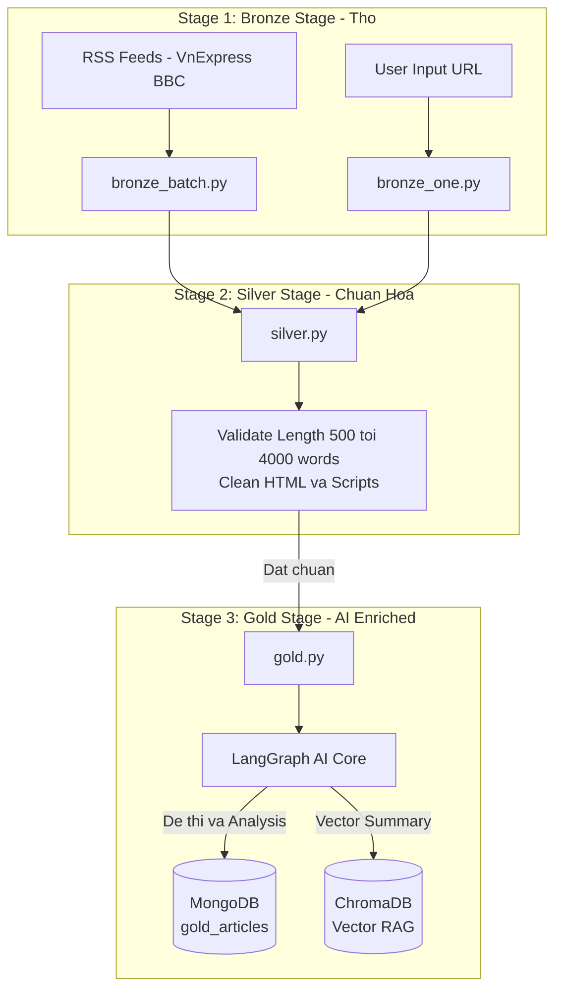
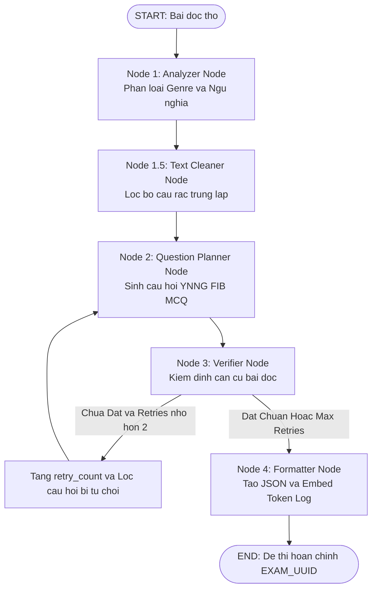

# ⚙️ Worker Service & AI Engine (`worker_service`) Documentation

Dịch vụ **`worker_service`** là trái tim xử lý dữ liệu ngầm và hệ thống trí tuệ nhân tạo (AI Engine) của dự án. Khối này chịu trách về các logic dịch vụ như nhiệm thu thập tin tức, làm sạch dữ liệu và vận hành đường ống AI Agent (**LangGraph**) để sinh các Exam tự động.

---

Dịch vụ bao gồm 3 thành phần mô-đun hóa chính, và sau này sẽ containerize riêng biệt để tách với logic của trang web django. 

Hiện tại logic của DJango sẽ không tùy tiện gọi các hàm/ lớp trong worker service. Các thành phần của worker service sẽ hoạt động độc lập và chỉ tương tác với DJango thông qua API hoặc các tác vụ được lên lịch định kỳ (Cron Job).


1. **`database/`**: Tầng trừu tượng hóa tương tác với các hệ cơ sở dữ liệu (`Mongo`, `Chroma`) và công cụ thu thập dữ liệu (`Crawler`), có cấu trúc đồng bộ với `ReadAndQues/database`.
2. **`data_pipeline/`**: Đường ống xử lý dữ liệu 3 tầng theo kiến trúc **Medallion Architecture (Bronze ➔ Silver ➔ Gold)**.
3. **`ai_core/`**: Hệ thống AI Agent xây dựng trên **LangGraph**, chịu trách nhiệm phân tích bài đọc, thiết lập bộ Exam chuẩn hóa và tự kiểm định chất lượng (Self-Verification).

# Lưu ý:
khi thực hiện chạy các logic liên quan đến việc sinh câu hỏi thông qua llm (azure openai) tuyệt đối phải restrict Max number/ số lần gọi api (để tránh sử dụng hết credit ai huhu)

---

## 🏗️ 2. Kiến Trúc Medallion Data Pipeline (`data_pipeline`)

Đường ống dữ liệu biến đổi tin tức thô từ Internet thành bài thi IELTS giàu tri thức thông qua 3 tầng lưu trữ:



### 2.1. Bronze Stage (Tầng Dữ Liệu Thô)
- **Files**: `bronze_batch.py` (crawl tự động hàng loạt từ danh sách RSS) và `bronze_one.py` (crawl 1 URL bất kỳ do người dùng yêu cầu).
- **Chức năng**: Sử dụng `requests` và `BeautifulSoup` để trích xuất tiêu đề, nội dung HTML thô, ảnh minh họa và metadata ban đầu.

### 2.2. Silver Stage (Tầng Dữ Liệu Chuẩn Hóa)
- **File**: `silver.py`.
- **Chức năng**:
  - Bóc tách toàn bộ thẻ HTML rác, đoạn mã JavaScript, bài viết liên quan và quảng cáo.
  - Chuyển đổi định dạng về văn bản thuần (Clean Text).
  - Kiểm tra điều kiện độ dài chuẩn IELTS: Bài đọc bắt buộc phải có từ **500 đến 4000 từ**.

### 2.3. Gold Stage (Tầng Dữ Liệu AI Đã Sinh Đề)
- **File**: `gold.py`.
- **Chức năng**:
  - Đọc các tài liệu Silver chưa xử lý.
  - Kích hoạt **LangGraph AI Pipeline** để sinh đề thi IELTS.
  - Lưu kết quả hoàn chỉnh vào MongoDB `gold_articles` và tạo Vector Embedding trong **ChromaDB** để phục vụ gợi ý bài đọc liên quan (Semantic RAG Search).
  - Hỗ trợ cả 2 chế độ: **Batch Process** (chạy hàng loạt) và **Async Thread Process** (`process_one_gold_async` phục vụ giao diện người dùng web).

---

## 🤖 3. AI Core — LangGraph 4-Node Pipeline (`ai_core`)

Quy trình AI được thiết kế dạng **Phản Tư Đa Agent (Self-Reflective Multi-Node Graph)** giúp loại bỏ tình trạng AI bịa đặt (Hallucination) và đảm bảo các câu hỏi hoàn toàn bám sát văn bản.



### 3.1. Chi Tiết Các Node Trong Pipeline (`graph.py`)

#### 1️⃣ Node 1 — Analyzer (`node_analyzer`)
- **Nhiệm vụ**: Phân tích ngữ nghĩa chuyên sâu và phân loại thể loại văn bản.
- **Output**: `SemanticAnalysis` Pydantic Object bao gồm:
  - `genre`: Phân loại 1 trong 5 thể loại (`scientific`, `narrative`, `persuasive`, `poetry`, `core`).
  - `theme`: Chủ đề chính (Kinh tế, Xã hội, Công nghệ, Y học...).
  - `key_arguments`: Các ý chính và bằng chứng theo đoạn.
  - `irrelevant_snippets`: Phát hiện các câu quảng cáo dư thừa còn sót lại.
- **LLM Temperature**: `0.0` (Đảm bảo phân loại ổn định và nhất quán).

#### 1️⃣.5️⃣ Node 1.5 — Text Cleaner (`node_text_cleaner`)
- **Nhiệm vụ**: Xử lý dữ liệu thuần Python (Pure Python). Tự động loại bỏ các đoạn `irrelevant_snippets` mà Node Analyzer phát hiện ra khỏi bài đọc gốc.

#### 2️⃣ Node 2 — Question Planner (`node_question_planner`)
- **Nhiệm vụ**: Sinh các dạng câu hỏi IELTS Academic dựa trên kết quả phân tích ngữ nghĩa:
  - **YNNG (Yes / No / Not Given)**: Kiểm tra khả năng hiểu quan điểm/bằng chứng của tác giả.
  - **FIB (Fill-in-the-blanks)**: Hoàn thành tóm tắt đoạn văn với từ ngữ lấy chính xác từ bài.
  - **MCQ (Multiple Choice)**: Câu hỏi trắc nghiệm 4 lựa chọn với các phương án nhiễu (distractors) logic.
- **LLM Temperature**: `0.3` (Cho phép linh hoạt sinh câu hỏi đa dạng).

#### 3️⃣ Node 3 — Verifier (`node_verifier`) & Reflective Loop
- **Nhiệm vụ**: Kiểm định tính chính xác tuyệt đối. Đóng vai trò là một "Giám khảo IELTS" khắt khe.
- **Cơ chế**:
  - Đối chiếu từng câu hỏi và đáp án với văn bản gốc.
  - Nếu câu hỏi bị suy diễn hoặc thiếu căn cứ ➔ Thêm chỉ số câu hỏi vào `rejected_indices`.
  - **Vòng lặp tự sửa lỗi (Retry Loop)**: Nếu `passed == False` và `retry_count < 2`, hệ thống quay lại **Question Planner** để sinh lại câu hỏi mới.

#### 4️⃣ Node 4 — Formatter (`node_formatter`)
- **Nhiệm vụ**: Đóng gói không dùng LLM (Pure Data Transformation).
- **Kết quả**: Gắn mã định danh `EXAM_UUID`, tổng hợp danh sách câu hỏi đã qua kiểm định, tính toán và nhúng `token_log` (Input/Output tokens của toàn bộ các bước) để lưu vào cơ sở dữ liệu.

---

## 🔍 4. Vector Storage & Semantic RAG (ChromaDB Integration)

Hệ thống tích hợp **ChromaDB** làm Vector Database cho các bài báo đã được AI xử lý thành công:

- **Bộ sưu tập (Collection)**: `articles_collection`.
- **Dữ liệu lưu trữ**: Đoạn văn tóm tắt bài đọc (`summary`), Tiêu đề (`title`), URL và `gold_id`.
- **Chức năng chính**:
  - **Lưu trữ Vector Embedding (`add_article_vector`)**: Sau khi sinh đề thi thành công, tóm tắt bài viết được nhúng vào ChromaDB.
  - **Truy vấn bài viết liên quan (`get_related_articles_via_chroma`)**: Sử dụng tóm tắt của bài báo đang xem để tìm kiếm vector gần nhất (Cosine Similarity), từ đó trả về danh sách các bài viết liên quan (Related Articles/Documents) hiển thị trên giao diện người dùng.


---

## 📋 5. Bảng Cấu Trúc Pydantic Schemas (`schemas.py`)

Dữ liệu trao đổi giữa các Node được đảm bảo tính toàn vẹn thông qua các **Pydantic Models**:

| Model Class | Vai Trụ & Nội Dung Chứa |
| :--- | :--- |
| **`SemanticAnalysis`** | Chứa `theme`, `genre`, `summary`, `key_arguments`, `irrelevant_snippets`. |
| **`QuizItem`** | Đơn vị 1 câu hỏi IELTS (`question_id`, `type`, `question`, `options`, `answer`, `explanation`, `passage_evidence`). |
| **`ExamOutput`** | Danh sách tập hợp các câu hỏi `List[QuizItem]`. |
| **`VerifierFeedback`** | Kết quả đánh giá của Node Verifier (`passed: bool`, `rejected_indices: List[int]`, `reason: str`). |
| **`TokenUsageLog`** | Lưu lượng sử dụng token từng node (`node`, `input_tokens`, `output_tokens`). |
| **`ExamConfig`** | Cấu hình số lượng câu hỏi động dựa theo độ dài bài đọc. |

---

## 🗄️ 6. Tầng Trừu Tượng Hóa Cơ Sở Dữ Liệu (`worker_service/database`)

Gói **`worker_service/database/`** quản lý toàn bộ các tương tác với cơ sở dữ liệu MongoDB, Vector Store ChromaDB và công cụ cào dữ liệu Web Scraper, với cấu trúc hoàn toàn đồng bộ với `ReadAndQues/database`:

```text
worker_service/database/
├── Mongo/
│   ├── connection.py    # Kết nối PyMongo MongoClient và tạo các collection handle
│   └── crud.py          # Tập hợp các hàm CRUD trừu tượng cho Bronze, Silver, Gold, Logs & Indexes
├── Chroma/
│   ├── connection.py    # Kết nối HttpClient với ChromaDB (port 8002)
│   └── operations.py    # Hàm thêm/cập nhật Vector Embeddings (add_article_vector)
└── Crawler/
    ├── scraper.py       # Trích xuất văn bản & hình ảnh bài báo bằng Newspaper3k (crawl_article_content)
    └── formatter.py     # Định dạng văn bản thô sang Markdown chuẩn (to_markdown)
```

### 6.1. Mô-đun `Mongo` (`worker_service/database/Mongo`)
* **`connection.py`**: Thiết lập MongoClient độc lập, tự động đọc tham số từ file cấu hình `pipeline_config.py` hoặc biến môi trường `MONGO_URI`.
* **`crud.py`**: Cung cấp các phương thức làm việc sạch với MongoDB:
  - **Bronze**: `find_existing_bronze_urls()`, `get_bronze_by_url()`, `insert_bronze_doc()`, `get_unprocessed_bronze_docs()`.
  - **Silver**: `save_silver_doc()`, `get_silver_by_id()`, `get_silver_by_bronze_id()`, `get_unprocessed_silver_docs()`.
  - **Gold**: `insert_gold_doc()`, `get_gold_by_id()`, `update_gold_doc()`.
  - **Logs**: `insert_pipeline_log()`.
  - **Indexing**: `init_mongo_indexes()` quản lý chỉ mục cho tất cả các collection.

### 6.2. Mô-đun `Chroma` (`worker_service/database/Chroma`)
* **`connection.py`**: Khởi tạo client kết nối tới ChromaDB container (port 8002).
* **`operations.py`**:
  - `add_article_vector(gold_id, summary, title, url)`: Thêm/cập nhật Vector Embedding tóm tắt bài báo vào ChromaDB.
  - `get_related_articles_via_chroma(article, exclude_id, limit)`: Truy vấn các bài viết liên quan theo khoảng cách vector ngữ nghĩa (Semantic RAG Search).


### 6.3. Mô-đun `Crawler` (`worker_service/database/Crawler`)
* **`scraper.py`**: Chứa hàm `crawl_article_content(url)` thực hiện cào tiêu đề, văn bản thô và chọn lọc ảnh tiêu biểu (Top Image / Image List).
* **`formatter.py`**: Chứa hàm `to_markdown(text)` chuẩn hóa cấu trúc đoạn văn bản và danh sách bullet-points (lúc đầu tính dùng llm để làm chuẩn hóa nội dung từ text -> markdown nhưng sợ tốn token nên mới define các quy tắc để tự convert sang)


