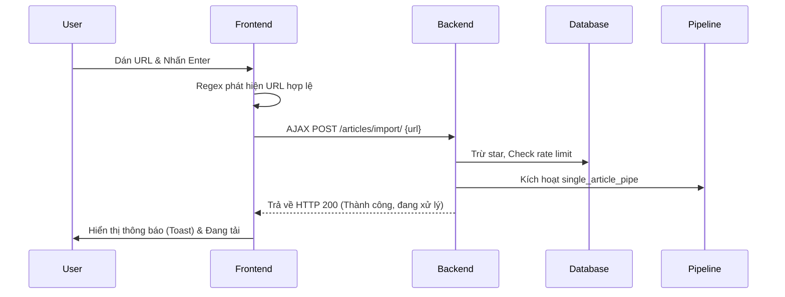
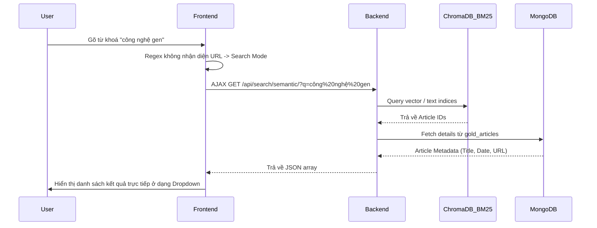

# Kế hoạch triển khai - Trùng tu chức năng tìm kiếm (TASK 4)

## 1. Mục tiêu (Objectives)
- **Tự động nhận diện (Auto-detect)** đầu vào của thanh tìm kiếm: phân biệt rõ giữa nhập URL (để import) và nhập text (để tìm kiếm).
- **Import bài báo qua URL**: Cải thiện UX/UI của chức năng hiện tại. Khi paste URL, tự động chạy pipeline và hiển thị trạng thái xử lý rõ ràng.
- **Tìm kiếm theo từ khóa (BM25)**: Bổ sung tính năng server-side search truyền thống dựa trên từ khóa, tận dụng hệ thống BM25 đã có.
- **Tìm kiếm thông minh AI (Semantic Search)**: Tích hợp tính năng AI search, tìm kiếm dựa trên ngữ nghĩa sử dụng ChromaDB vector database.

## 2. Phân tích hiện trạng (Current State Analysis)
- **UI/UX**: Thanh tìm kiếm (Global Omni Search Bar) nằm ở `base.html` header, hiện tại chỉ nhận paste URL và gọi API import qua AJAX (POST `/articles/import/`). Không có tính năng search nội bộ trên thanh này.
- **Backend Import**: Khi gọi `/articles/import/`, view `import_article` thực hiện rate limit, trừ star, sau đó gọi `import_and_trigger_pipeline`.
- **Hạ tầng tìm kiếm (DB/Search Engines)**:
  - Đã có BM25 (trong `database/BM25/operations.py`, với hàm `search_articles(query_text)`).
  - Đã có ChromaDB (trong `database/Chroma/operations.py`, với hàm `query_related_chroma_ids(summary, exclude_id, limit)`).
  - MongoDB `gold_articles` lưu trữ metadata và text (title, original_text, clean_text).
  - File `all_tests.html` có client-side search đơn giản nhưng không thể mở rộng.
- **Khuyết điểm hiện tại**: Chưa có cơ chế search tài nguyên cũ trên hệ thống, chưa phân tách các loại input linh hoạt, và giao diện thiếu feedback khi hệ thống đang xử lý bài báo.

## 3. Thiết kế chi tiết (Detailed Design)

### 3.1. Auto-detect Input trên Frontend
- Bắt sự kiện `input` hoặc `submit` trên Omni Search Bar (`base.html`).
- Sử dụng Regex để nhận diện định dạng URL: `^(https?:\/\/)[\w.-]+(?:\.[\w\.-]+)+[\w\-\._~:/?#[\]@!\$&'\(\)\*\+,;=.]+$`
- **Luồng logic**:
  - Nếu là **URL**: Chuyển UI thanh tìm kiếm sang chế độ "Import Mode". Khi kích hoạt, gọi POST `/articles/import/`.
  - Nếu là **Text**: Chuyển chế độ sang "Search Mode". Cung cấp tuỳ chọn tìm kiếm BM25 hoặc AI (có thể bằng toggle/switch). Khi submit/gõ, gọi GET request để search.

### 3.2. Cải thiện UX Import qua URL
- Vô hiệu hoá (disable) input/nút bấm khi đang gửi request.
- Hiển thị UI spinner / progress status ngay dưới ô tìm kiếm để user biết pipeline đang chạy (ví dụ luồng `single_article_pipe`).
- Khi backend báo thành công, redirect user thẳng tới trang đọc báo hoặc reload danh sách `get_completed_articles_pipe`.

### 3.3. Tích hợp BM25 Search (Keyword Search)
- Tạo API endpoint: `GET /api/search/keyword/?q={query}`
- Logic Backend:
  - Nhận chuỗi `query` từ frontend.
  - Truyền `query` vào hàm `search_articles(query_text)` của BM25.
  - Trả về danh sách JSON (Article ID, Title, Snippet/Summary, Timestamp).

### 3.4. Tích hợp AI Search (ChromaDB)
- Tạo API endpoint: `GET /api/search/semantic/?q={query}`
- Logic Backend:
  - Embed text `query` thành vector sử dụng cùng model embedding với ChromaDB hiện tại.
  - Viết hàm `search_by_text(query: str, limit: int)` mới trong `database/Chroma/operations.py` để query các vectors gần nhất.
  - Map các `chroma_ids` tìm được với MongoDB `gold_articles` để lấy dữ liệu (Title, Clean Text snippet).
  - Trả về danh sách JSON tương tự kết quả của BM25, có thêm độ tương đồng (score).

## 4. Các file cần tạo/sửa/xóa (Files to create/modify/delete)

- **`templates/base.html` (Sửa)**
  - Cập nhật HTML cấu trúc Omni Search Bar. Thêm container cho dropdown hiển thị kết quả và status toast.
- **`static/js/omni_search.js` (Tạo mới)**
  - Tách logic Javascript của thanh search thành một module riêng (regex check, debounce API calls, toggle mode, render results).
- **`articles/views.py` hoặc module API mới (Sửa/Tạo mới)**
  - Thêm các views xử lý: `search_bm25_api(request)` và `search_ai_api(request)`.
- **`articles/urls.py` (Sửa)**
  - Định nghĩa các URL path mới `/api/search/keyword/` và `/api/search/semantic/`.
- **`database/Chroma/operations.py` (Sửa)**
  - Bổ sung logic search query string (thay vì chỉ query_related bằng summary text hiện có).

## 5. Luồng dữ liệu (Data Flow)

### Luồng URL Import:


### Luồng Search (BM25 / AI):


## 6. Wireframe (Mô phỏng Giao diện)

```text
[ 🔍 ]  Nhập URL bài viết để dịch, hoặc nhập từ khoá tìm kiếm...      [ AI Mode: ON/OFF ]
-----------------------------------------------------------------------------------------
| (Đang gõ văn bản - Chế độ Tìm Kiếm)                                                   |
|                                                                                       |
| ⚡ Ý định: Tìm kiếm Semantic (AI) cho "công nghệ gen"                                   |
|                                                                                       |
| 1. [Bài báo] Kỹ thuật chỉnh sửa gen CRISPR mới nhất (Độ tương đồng: 95%)              |
| 2. [Bài báo] Ứng dụng AI trong y sinh và di truyền (Độ tương đồng: 88%)               |
|                                                                                       |
| ↳ Xem tất cả kết quả                                                                  |
-----------------------------------------------------------------------------------------
```

## 7. Checklist triển khai (Implementation Checklist)
- [ ] Bổ sung function query từ raw text vào `database/Chroma/operations.py`.
- [ ] Tạo views xử lý API GET `/api/search/keyword/` (BM25) và `/api/search/semantic/` (ChromaDB).
- [ ] Thêm URL routing cho 2 views search.
- [ ] Cập nhật `base.html` để tái thiết kế Omni Search Bar, bao gồm toggle AI/BM25.
- [ ] Viết script `omni_search.js` xử lý auto-detect Regex URL vs Text.
- [ ] Thêm logic **Debounce** (~300-500ms) khi gõ text search để tránh ddos server.
- [ ] Thêm loading spinner UI cho luồng paste URL import hiện tại.
- [ ] Cập nhật UI render các dòng kết quả search từ JSON response ngay trên thanh navbar.
- [ ] Test toàn bộ luồng, đảm bảo import hiện tại qua view `import_article` không bị gãy.

## 8. Rủi ro và lưu ý (Risks & Notes)
- **Hiệu suất AI Search (Latency)**: Mỗi query AI cần đi qua một bước tính vector embedding. Nếu việc này mất quá nhiều thời gian, có thể làm dropdown search chậm. Khắc phục bằng cách dùng debounce kỹ trên Frontend và cache những truy vấn phổ biến.
- **Limit/Pagination**: Trong UI thanh tìm kiếm (dropdown/autocomplete), cần giới hạn số lượng kết quả (limit = 5). Cần thiết kế thêm một trang `/search-results/?q=` riêng để hiển thị toàn bộ list khi người dùng muốn xem thêm.
- **Trải nghiệm Mobile**: Giao diện Dropdown và Omni Search cần responsive tốt trên mobile, tránh việc bàn phím ảo che mất hoặc gây lộn xộn UI.
- **Xử lý ngoại lệ (Error Handling)**: Cần hiển thị toast báo lỗi nếu rate limit bị vượt quá, hết star trong quá trình import URL, hoặc lỗi timeout do pipeline.
