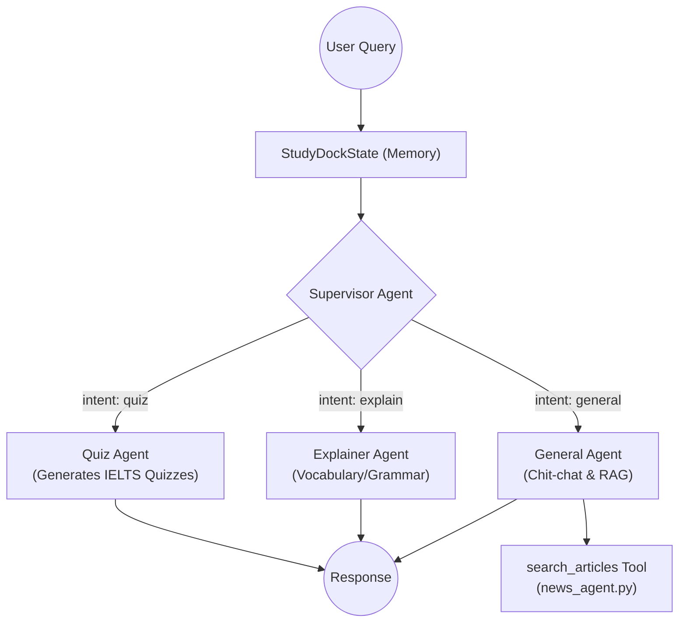

# AI Service (LangGraph Multi-Agent)

## 1. Overview
The AI Service (`ai_service/`) is the brain of ReadAndQues. It is built entirely on **LangChain** and **LangGraph**, operating as a stateful multi-agent system known as the **Study Dock**. 

## 2. Architecture & LangGraph Flow
The system uses a Supervisor-Worker pattern. A routing agent determines the user's intent and delegates the task to the appropriate specialized agent.

## 3. Key Directories & Files
*   **`ai_service/agents/graph.py`**: Defines the LangGraph state machine, nodes, and routing logic.
*   **`ai_service/agents/state.py`**: Defines `StudyDockState` (the shared memory state passed across agents).
*   **`ai_service/agents/tools.py`**: Contains executable tools like `search_articles` that agents can invoke dynamically.
*   **`ai_service/rag/agents/news_agent.py`**: The core RAG engine performing Hybrid Search (BM25 + ChromaDB) and Cross-Encoder reranking.
*   **`ai_service/interface.py`**: The **strictly defined public boundary**. The Django backend interacts with the AI Service *only* through functions exported here (e.g., `ask_study_dock`, `stream_study_dock_sync`).
*   **`ai_service/prompts/`**: Stores system prompts to keep agent behavior decoupled from core execution logic.

## 4. Best Practices Adopted
*   **Encapsulation**: The AI subsystem is fully isolated. The backend never imports LangChain directly.
*   **Streaming**: Delivers true token-by-token real-time streaming to the user interface via LangGraph's native `astream_events(v2)`.
*   **Modularity**: Legacy monolithic flows have been removed. Tools can be easily added to the General Agent without disrupting existing workflows.
