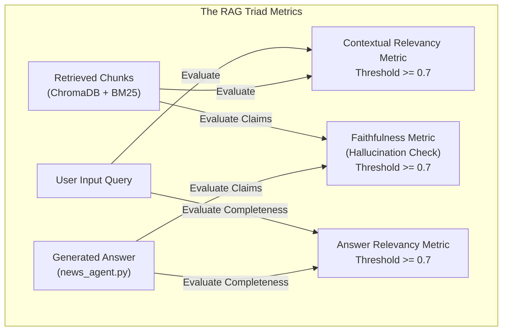

# Continuous Evaluation & Quality Benchmarking

The **Evaluation Subsystem** (`evaluation/`) provides an automated, quantifiable test suite for the AI Service and RAG pipeline. Using **DeepEval** (an industry-standard LLM-as-a-judge framework), it evaluates hallucination rates, retrieval relevancy, answer quality, and agent routing precision against curated ground-truth datasets.

---

## 1. What It Does (Business & Quality Assurance Overview)

Generative AI applications cannot rely solely on traditional unit tests (e.g., asserting string equality). A small prompt tweak or model version update can subtly introduce hallucinations or degrade retrieval accuracy.

The evaluation suite ensures:
* **Hallucination Prevention:** Quantifies whether LLM answers are strictly grounded in retrieved news articles.
* **Retrieval Verification:** Measures whether the hybrid search (ChromaDB + BM25) and reranking pipeline retrieves the necessary context.
* **Agent Routing Reliability:** Validates that the Supervisor accurately classifies user intent across diverse queries without misrouting.
* **Regression Guard in CI/CD:** Fails pull requests if quality scores fall below strict production thresholds ($\ge 0.7$).

---

## 2. How It Works (Architectural & Technical Deep Dive)

The evaluation suite is implemented in:
* `evaluation/test_rag_triad.py`: Execution of the classic RAG Triad metrics.
* `evaluation/test_agent_quality.py`: Supervisor routing and tool-calling accuracy.
* `evaluation/utils.py`: Judge model setup, dataset loading, and report generation.
* `evaluation/datasets/`: Golden benchmark datasets (`rag_eval_dataset.json`).
* `evaluation/results/`: Persisted JSON run reports and scorecards.

### The RAG Triad Architecture



---

### The Three Core Metrics (`test_rag_triad.py`)

#### 1. Faithfulness Metric (`FaithfulnessMetric`)
* **What it measures:** Factual grounding and hallucination rate.
* **How it works:** The LLM Judge extracts all truth claims from the generated answer and checks each claim against the retrieved context passages.
* **Formula:**
  $$\text{Faithfulness Score} = \frac{\text{Number of claims supported by context}}{\text{Total claims made in answer}}$$
* **Pass Threshold:** **0.7** (Scores below 0.7 indicate unsupported or hallucinated claims).

#### 2. Answer Relevancy Metric (`AnswerRelevancyMetric`)
* **What it measures:** Query alignment. Does the answer directly address what the user asked, or does it ramble into tangential topics?
* **How it works:** The Judge evaluates the semantic similarity between the user query and the primary points made in the generated answer.
* **Pass Threshold:** **0.7**.

#### 3. Contextual Relevancy Metric (`ContextualRelevancyMetric`)
* **What it measures:** Retrieval precision. Are the passages fetched by ChromaDB and BM25 directly relevant to the question, or is the context cluttered with noise?
* **How it works:** The Judge assesses what percentage of sentences in the retrieved context contain information useful for answering the input query.
* **Pass Threshold:** **0.7**.

---

## 3. Agent Quality & Routing Test Suite (`test_agent_quality.py`)

Beyond RAG answers, the multi-agent system must correctly classify intent:

| Test Case Category | Query Example | Expected Intent | Tool Invocation Expectation |
| :--- | :--- | :--- | :--- |
| **Quiz Requests** | *"Can you give me 3 questions about this article?"* | `"quiz"` | No tool calls; dispatches to `quiz_agent`. |
| **Vocabulary & Grammar**| *"What does 'unprecedented' mean here?"* | `"general"` | No tool calls; answers from active text. |
| **Factual News Search** | *"What are recent discoveries in Antarctica ice?"* | `"general"` | Must invoke `search_articles` tool. |
| **General Chit-Chat** | *"Hello, how can you help me read better?"* | `"general"` | No tool calls; direct conversational reply. |

The test suite asserts:
1. `final_state["intent"] == expected_intent`
2. `tools_invoked == expected_tools`
3. Latency benchmarks ($< 1500\text{ ms}$ for routing).

---

## 4. Benchmark Datasets (`evaluation/datasets/`)

The primary dataset (`rag_eval_dataset.json`) contains representative queries spanning multiple news genres:

```json
[
  {
    "input": "What was the main challenge in printing certain configurations before using AI, according to Azza Fadhel?",
    "target_article_id": "art_a009616ef1586305",
    "expected_theme": "Technology"
  },
  {
    "input": "Why might excessive Vitamin C intake lead to kidney stones?",
    "target_article_id": "art_41eacdc167cd47be",
    "expected_theme": "Health"
  },
  {
    "input": "Who is Lucia Crivelli and what is her role in the lifestyle intervention study?",
    "target_article_id": "art_50093d064b156524",
    "expected_theme": "Science"
  }
]
```

---

## 5. How to Run Evaluations

### Running the Full RAG Triad Suite
```bash
# Ensure environment variables are loaded
export AZURE_OPENAI_API_KEY="your-key"
export AZURE_OPENAI_ENDPOINT="https://..."

# Run RAG Triad evaluation
python -m evaluation.test_rag_triad
```

### Running Agent Routing Quality Tests
```bash
python -m evaluation.test_agent_quality
```

### Output Reports (`evaluation/results/`)
Each evaluation run exports an automated report detailing:
* Overall pass/fail status per metric.
* Individual score breakdowns per question.
* Specific reasoning traces from the LLM Judge explaining why any score fell below the 0.7 threshold.
