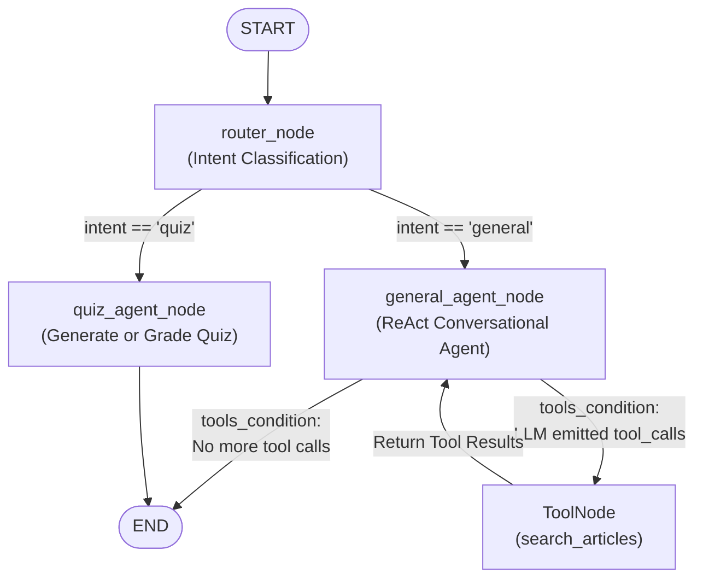
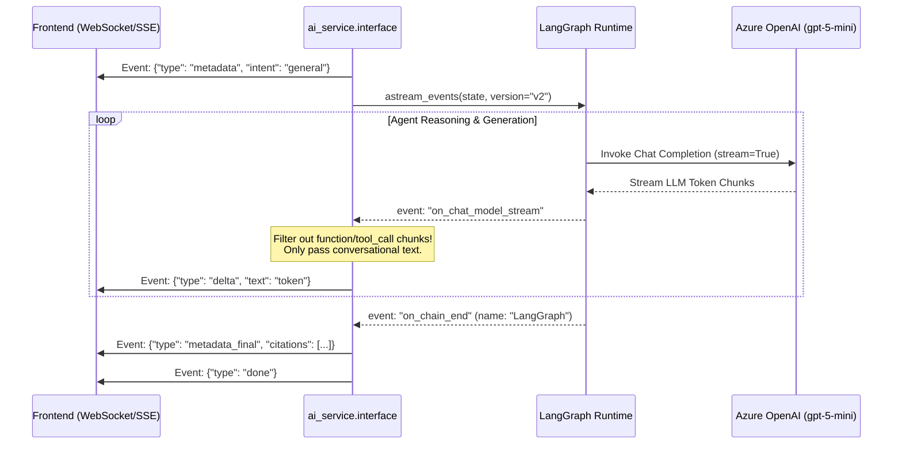

# Multi-Agent System: The Study Dock

The **Multi-Agent System** (known as the **Study Dock**) powers the interactive reading companion in ReadAndQues. Built on **LangGraph**, it coordinates specialized agent nodes, maintains short/long-term conversational memory, and delivers real-time token streaming to the frontend.

---

## 1. What It Does (Business & User Experience Overview)

When reading English articles, users have diverse, fast-changing intents:
* **Contextual Explanations:** Asking about difficult vocabulary, complex idioms, or grammatical structures within the current paragraph.
* **Factual & World Knowledge Inquiries:** Asking for broader real-world context, historical background, or related news stories beyond the active text.
* **On-Demand Comprehension Quizzing:** Requesting interactive IELTS-style quizzes (Multiple Choice, True/False/Not Given) to test their understanding of the article.
* **Curated Article Recommendations:** Asking on the homepage for articles suited to their CEFR English level and reading interests.

Instead of forcing a single, massive prompt to handle all these modalities, the Study Dock deploys a **Supervisor-Worker Multi-Agent Architecture** that routes each query to the best-suited agent while maintaining a unified conversational session.

---

## 2. How It Works (Architectural & Technical Deep Dive)

The system is defined in `ai_service/agents/`:
* `graph.py`: The LangGraph state machine definition and compilation.
* `state.py`: The shared memory state schema (`StudyDockState`).
* `router.py`: Fast LLM intent classification node.
* `general_agent.py`: Conversational ReAct agent equipped with search tools.
* `quiz_agent.py`: Interactive assessment agent generating structured quizzes.
* `tools.py`: ToolNode bindings (`search_articles`).
* `memory.py`: Persistent checkpointer and conversation history management.

### LangGraph Topology



---

### Deep Dive: Core Components

#### A. State Schema (`StudyDockState`)
The central state extends LangGraph's native `MessagesState` to inherit list-based short-term chat memory:

```python
class StudyDockState(MessagesState):
    # Contextual attributes
    article_id: str                      # Current article ID (if in ReadSpace)
    page_context: str                    # "readspace" | "homepage" | "all_tests"
    article_text: str                    # Plain text of the active article
    user_id: int | None                  # Authenticated user ID

    # Memory & Personalization
    conversation_summary: str            # Summarized historical context
    user_profile: dict[str, Any]         # CEFR level, weak skills, topics

    # Intent routing
    intent: str                          # "quiz" | "general"

    # Agent output attributes
    response: str                        # Final markdown response
    citations: list[dict[str, Any]]      # Source citations from RAG
    quiz_data: list[dict[str, Any]]      # Generated quiz items (if quiz intent)
    action_type: str                     # "chat" | "quiz"
    error: str                           # Error message if a failure occurred
```

#### B. Router Node (`router.py`)
* The `router_node` evaluates the latest user message alongside `page_context` and recent conversation history.
* It uses a compact, high-speed LLM prompt to classify the user's intent into either:
  * `"quiz"`: The user explicitly requests a quiz, test, comprehension check, or asks to practice reading skills.
  * `"general"`: Any explanation, chit-chat, translation, or real-world factual question.
* It sets `state["intent"]`, which drives the conditional edge `route_by_intent`.

#### C. General Agent (`general_agent.py`) & ReAct Loop
* The `general_agent_node` binds the `GENERAL_AGENT_TOOLS` list (containing `search_articles`).
* **Context Awareness:**
  * If `page_context == "readspace"`, the prompt injects the active article's text, instructing the agent to prioritize answering from the text before searching externally.
  * If `page_context == "homepage"`, the agent uses `search_articles` to recommend relevant articles from the archive.
* **Tool Calling Decision:** If the user asks about real-world facts, current events, or related articles, the agent emits a `tool_call` to `search_articles`. LangGraph's prebuilt `ToolNode` executes the tool and feeds the result back to `general_agent` for final synthesis.

#### D. Quiz Agent (`quiz_agent.py`)
* When the router classifies an intent as `"quiz"`, execution jumps to `quiz_agent_node`.
* The quiz agent inspects `article_text`. If an article is active, it generates 3–5 targeted questions (Multiple Choice or True/False/Not Given) aligned with the user's CEFR level.
* It populates `state["quiz_data"]` with structured question objects and sets `state["action_type"] = "quiz"`.

#### E. Memory & Checkpointer (`memory.py`)
* Study Dock uses LangGraph's **Checkpointer** pattern (`get_checkpointer()`).
* Every conversation session is keyed by a `thread_id` (`{"configurable": {"thread_id": "thread_abc123"}}`).
* Messages, state variables, and tool outputs are saved after every step.
* When a user reloads the page or returns to the article, supplying the same `thread_id` seamlessly restores full conversational context without re-sending past messages over the wire.

---

## 3. Real-Time Token Streaming Architecture

A critical technical challenge in multi-agent systems is delivering **true real-time token streaming** while filtering out internal tool execution artifacts.



### Event Payload Specification (SSE / WebSocket)

| Event Type | Field | Description |
| :--- | :--- | :--- |
| `metadata` | `intent`, `action_type` | Emitted immediately before LLM generation begins to notify the UI. |
| `delta` | `text` | Real-time text chunk (1–3 words) streamed directly from the LLM. |
| `metadata_final`| `citations`, `quiz_data`, `response` | Emitted when LangGraph reaches `END`, containing structured RAG citations or quiz payloads. |
| `done` | (empty) | Signals the client to close the stream. |

### Synchronous WSGI Bridge (`stream_study_dock_sync`)
Because traditional Django WSGI workers run synchronously in gthread pools, `ai_service.interface` provides `stream_study_dock_sync()`. It manages an internal `asyncio` event loop to safely consume `stream_study_dock()` and yield events synchronously without thread-locking or blocking the server.

---

## 4. Guardrails & Safety Mechanisms

| Vulnerability / Risk | Mitigation Strategy |
| :--- | :--- |
| **Tool Calling Loops (Infinite ReAct)** | LangGraph's recursion limit prevents cycles. `search_articles` prompt strictly warns against calling the tool more than once per query. |
| **Tool Argument Leakage to User** | `stream_study_dock` checks `getattr(chunk, "tool_call_chunks", None)`. Tool arguments are excluded from `delta` events. |
| **Missing Article Context** | If a user asks a passage question but `article_text` is empty, `general_agent` prompts the user to select or open an article first. |
| **Checkpointer Database Disconnection** | Falls back to in-memory `MemorySaver()` if the external checkpointer connection is unreachable. |
