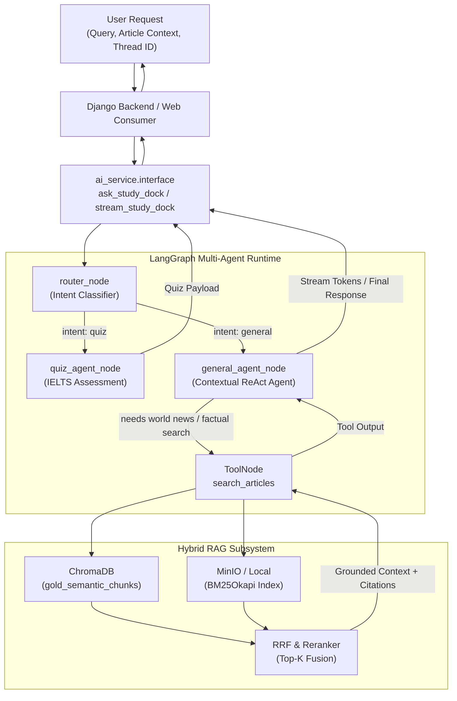

# AI Service Overview

The **AI Service** (`ai_service/`) is the intelligent core of ReadAndQues. It encapsulates all Large Language Model (LLM), Multi-Agent orchestration, and Retrieval-Augmented Generation (RAG) operations into an independent, decoupled Python package.

---

## 1. Architectural Philosophy & Design Principles

```
┌─────────────────────────────────────────────────────────────────────────┐
│                      External Callers & Applications                    │
│      (Django Web Backend, Dagster Data Pipeline, Evaluation Runner)     │
└────────────────────────────────────┬────────────────────────────────────┘
                                     │ Only imports from
                                     ▼
┌─────────────────────────────────────────────────────────────────────────┐
│                  FACADE: ai_service.interface                           │
│  - Unified, typed entry points (ask_study_dock, stream_explanation, etc)│
│  - Strict boundary: No LangChain/LangGraph imports leak outside        │
└──────────────────┬──────────────────┬──────────────────┬────────────────┘
                   │                  │                  │
                   ▼                  ▼                  ▼
┌────────────────────────┐ ┌──────────────────┐ ┌─────────────────────────┐
│ Multi-Agent Study Dock │ │ Hybrid RAG       │ │ Specialized Engines     │
│ (LangGraph Supervisor, │ │ (ChromaDB Vector,│ │ (IELTS Quiz Generator,  │
│  General, Quiz, Tools) │ │  BM25 Lexical,   │ │  Contextual Explainer)  │
│                        │ │  RRF Reranking)  │ │                         │
└────────────────────────┘ └──────────────────┘ └─────────────────────────┘
```

The AI Service is built around four foundational architectural principles:

### A. The Facade Pattern (`ai_service.interface`)
External callers (such as Django views, WebSocket consumers, and Dagster pipelines) **never** import LangChain, LangGraph, ChromaDB, or OpenAI directly. All interactions flow through a single public contract: `ai_service/interface.py`. This ensures:
* **Zero Framework Leakage:** If the underlying agent framework transitions from LangGraph to another framework, zero lines of Django code need to change.
* **Stable Interface:** Public signatures (`ask_study_dock`, `generate_quiz`, `explain_phrase`, `search_articles`) use native Python types (`dict`, `list`, `str`, `Generator`).

### B. Stateful Multi-Agent Collaboration (LangGraph)
Rather than relying on brittle, monolithic prompt chains, the reading assistant (**Study Dock**) uses **LangGraph** to model an explicit state machine:
* A lightweight **Supervisor Router** classifies user intent.
* Execution branches dynamically to specialized agents (`quiz_agent`, `general_agent`).
* The `general_agent` operates in a **ReAct loop**, dynamically querying the RAG knowledge base via tools only when factual news grounding is required.

### C. True Real-Time Token Streaming
User experience requires instantaneous token streaming over WebSockets and Server-Sent Events (SSE). The system leverages LangGraph's native `astream_events(v2)`:
* Emits text deltas directly from LLM generation without artificial chunk buffering.
* Filters out internal tool-call JSON arguments so only conversational prose streams to the user.
* Provides a synchronous bridge (`stream_study_dock_sync`) allowing standard WSGI/gthread workers to stream tokens seamlessly.

### D. Grounded Multi-Modal Retrieval (Hybrid RAG)
Factual accuracy is paramount. Answers to real-world questions are strictly grounded via a two-stage hybrid retrieval pipeline:
1. **Candidate Retrieval:** Parallel dense vector search in **ChromaDB** (`gold_semantic_chunks`) and sparse lexical search in **BM25** (trained on clean article text).
2. **Reranking:** Reciprocal Rank Fusion (RRF) and Cross-Encoder scoring filter candidates down to the top $K$ high-confidence passages before LLM synthesis.

---

## 2. Component Landscape

The `ai_service/` package is structured into four primary subsystems:

| Subsystem | Key Directories & Files | Role & Responsibility |
| :--- | :--- | :--- |
| **Public API Facade** | `interface.py`, `adapters.py` | Single integration boundary for Django, Celery, and Dagster. |
| **Multi-Agent System**| `agents/` (`graph.py`, `router.py`, `general_agent.py`, `quiz_agent.py`, `memory.py`) | Stateful LangGraph workflow, short/long-term memory, intent routing, and ReAct tools. |
| **Hybrid RAG Subsystem** | `rag/` (`agents/news_agent.py`, `search/`, `grounding/`) | Vector & BM25 indexing, candidate retrieval, RRF/Cross-Encoder reranking, passage proof citations. |
| **Specialized Engines** | `quiz_generator/`, `explainer/` | Standalone Pydantic-enforced generators for IELTS reading quizzes and contextual vocabulary breakdowns. |
| **Model Connection** | `connection.py` | Model routing and factory for Azure OpenAI (`gpt-5-mini`, etc.). |
| **Automated Evaluation**| `evaluation/` (`test_rag_triad.py`, `test_agent_quality.py`) | Continuous verification of RAG Triad metrics (Faithfulness, Relevancy, Precision) using DeepEval. |

---

## 3. End-to-End Request Flow



---

## 4. Documentation Suite Navigation

To dive deep into specific components of the AI Service, explore the dedicated modular guides:

1. **[Multi-Agent System (`multi_agent_system.md`)](./multi_agent_system.md)**: Deep dive into the Study Dock LangGraph state machine, intent routing, ReAct agent loop, memory checkpointers, and real-time streaming mechanics.
2. **[Hybrid RAG Pipeline (`rag_pipeline.md`)](./rag_pipeline.md)**: Examination of the dense + sparse search architecture, Reciprocal Rank Fusion (RRF), Cross-Encoder reranking, and passage proof citation attribution.
3. **[Specialized Services (`specialized_services.md`)](./specialized_services.md)**: Architecture and Pydantic schemas for the IELTS Quiz Generator and Contextual Vocabulary Explainer.
4. **[Continuous Evaluation (`evaluation.md`)](./evaluation.md)**: Test suites using DeepEval to quantify Faithfulness, Answer Relevancy, Contextual Precision, and Agent Routing Quality.
5. **[Developer Handbook & API Reference (`dev_guide.md`)](./dev_guide.md)**: Full API function signatures, environment configurations, local test runbooks, and common troubleshooting tips.
