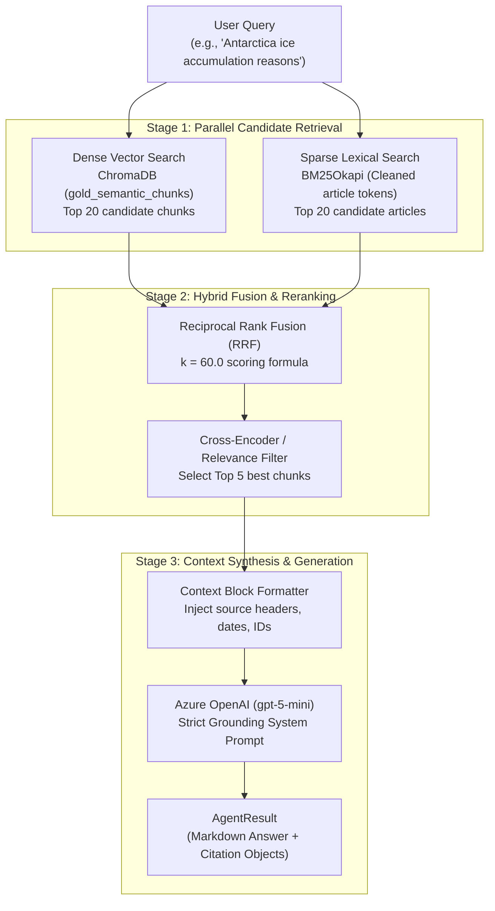

# Hybrid RAG Pipeline & Grounding Engine

The **Hybrid RAG Pipeline** (`ai_service/rag/`) grounds user queries in verified news articles. By combining **dense semantic search (ChromaDB)** with **sparse lexical search (BM25)** and passing candidate documents through a **Reciprocal Rank Fusion (RRF) & Reranking** stage, it delivers accurate, hallucination-free answers with verifiable source citations.

---

## 1. What It Does (Business & Functional Overview)

* **Factual Grounding:** Answers user queries about recent news events, scientific breakthroughs, and historical facts using articles ingested by the Data Pipeline.
* **Zero Hallucination Tolerance:** Enforces strict prompt and retrieval guardrails; if the retrieved articles do not contain the answer, the system explicitly admits lack of information rather than inventing facts.
* **Verifiable Source Citations:** Every generated claim is mapped back to its source article title, URL, and unique `article_id`.
* **Hybrid Lexical + Semantic Search:**
  * *Dense Vector Search* catches conceptual meaning, synonyms, and paraphrased questions.
  * *Sparse BM25 Search* catches exact entity names, acronyms, technical terminology, and numerical figures that vector embeddings often dilute.

---

## 2. How It Works (Architectural & Technical Deep Dive)

The RAG subsystem is organized in `ai_service/rag/`:
* `agents/news_agent.py`: High-level RAG orchestrator, query pipeline, prompt synthesis.
* `search/vector_store.py`: ChromaDB client, embedding generation, k-NN vector search.
* `search/bm25_index.py`: BM25Okapi lexical index search and tokenization.
* `grounding/reranker.py`: Cross-Encoder and rank-based candidate reranking.
* `grounding/passage_proof.py`: Sentence-level evidence extraction for quiz validation.
* `schemas.py`: Pydantic models for `Citation`, `AgentResult`, and retrieval payloads.

### End-to-End Retrieval Flow



---

### Step-by-Step Technical Execution

#### Step 1: Parallel Hybrid Retrieval
When `retrieve_and_rerank_context(query, ...)` is called:
1. **Dense Vector Search (`vector_search_chunks`):**
   * Encodes the query into an embedding vector.
   * Performs an approximate nearest neighbor (ANN) search over ChromaDB collection `gold_semantic_chunks`.
   * Returns the top 20 candidate chunks with similarity scores and metadata (`article_id`, `chunk_index`, `title`).
2. **Sparse Lexical Search (`search_bm25`):**
   * Tokenizes and cleans the query (stripping punctuation, converting to lowercase tokens).
   * Evaluates the query against the `BM25Okapi` index.
   * Returns the top 20 candidate documents based on BM25 frequency-inverse document frequency scores.

#### Step 2: Reciprocal Rank Fusion (RRF)
Vector search and BM25 scores operate on entirely different mathematical scales (cosine similarity vs unbounded BM25 scores). To combine them without arbitrary normalization weights, the pipeline applies **Reciprocal Rank Fusion (RRF)** with smoothing constant $k = 60.0$:

$$\text{RRF Score}(d) = \sum_{m \in \{\text{vector}, \text{bm25}\}} \frac{1}{k + \text{rank}_m(d)}$$

```python
rrf_k = 60.0
for rank, hit in enumerate(vector_hits):
    doc_key = hit["id"]
    rrf_score = 1.0 / (rrf_k + (rank + 1))
    rrf_map[doc_key] = {"rrf_score": rrf_score, "hit": hit, "sources": ["vector"]}

for rank, hit in enumerate(bm25_hits):
    article_id = hit["id"]
    # If article chunk already in map from vector search, accumulate score!
    if matching_key:
        rrf_map[matching_key]["rrf_score"] += 1.0 / (rrf_k + (rank + 1))
        rrf_map[matching_key]["sources"].append("bm25")
```

Documents appearing in **both** search lists receive significantly higher composite scores. The merged list is sorted by `rrf_score` descending.

#### Step 3: Reranking & Top-K Context Selection
* The top fused candidates are evaluated by `rerank_chunks()`.
* Chunks with low relevance scores or redundant text are pruned.
* The top $N$ chunks (default: 5 chunks) are selected to form the final grounded context.

#### Step 4: Prompt Synthesis with Strict Guardrails
The prompt formats each chunk with explicit source attribution headers:

```
=== RETRIEVED CONTEXT ===
[Document 1] Title: Antarctica gained a record 695 billion tons of ice
Article ID: art_b63f7920e6650b13 | URL: https://sciencedaily.com/...
Content: East Antarctica experienced record-breaking snowfall during late 2025...

[Document 2] Title: ...
```

The system prompt enforces strict rules:
1. *Only use information present in the context. Do NOT hallucinate.*
2. *Format in clean GitHub Flavored Markdown with bold keywords and structured bullet points.*
3. *Cite sources using `[Article Title](URL)` or `[Article Title] (ID: article_id)`.*
4. *If context is insufficient, state explicitly: "The current articles in the system do not contain enough information to answer this question."*

---

## 3. Data Contracts & Schemas

### A. `Citation` Schema (`schemas.py`)
Each citation returned alongside an answer adheres to the following structure:

```python
class Citation(BaseModel):
    article_id: str
    title: str
    url: str
    source: str
    chunk_id: str
    relevance_score: float
```

### B. `AgentResult` Schema (`schemas.py`)
```python
class AgentResult(BaseModel):
    answer: str                        # Formatted Markdown answer
    citations: list[Citation]          # List of verifiable sources
    intent: str                        # "factual_news", "general", etc.
    latency_ms: float                  # Execution time in milliseconds
    error: str | None = None           # Optional error trace
```

### Sample JSON Output from RAG Search
```json
{
  "answer": "**East Antarctica** gained approximately **695 billion tons** of ice due to unprecedented snowfall driven by extreme atmospheric river events [Antarctica gained a record 695 billion tons of ice](https://www.sciencedaily.com/releases/2026/09/260906101520.htm).\n\nKey factors identified by researchers include:\n- **Atmospheric Rivers:** Warm, moisture-laden air masses penetrating deep inland.\n- **Circumpolar Circulation:** Shifting wind patterns altering precipitation distribution.",
  "citations": [
    {
      "article_id": "art_b63f7920e6650b13",
      "title": "Antarctica gained a record 695 billion tons of ice. Scientists found the surprising reason",
      "url": "https://www.sciencedaily.com/releases/2026/09/260906101520.htm",
      "source": "ScienceDaily",
      "chunk_id": "art_b63f7920e6650b13_0",
      "relevance_score": 0.0328
    }
  ],
  "intent": "factual_news",
  "latency_ms": 482.5
}
```

---

## 4. Passage Proof & Verification Engine (`passage_proof.py`)

In addition to question answering, the RAG subsystem powers **Passage Proof**:
* When a user takes a quiz and answers a question (or reviews their mistakes), the system must prove **why** an answer is correct.
* `get_passage_proof(article_id, question_idx)` matches the quiz item's `supporting_text` against the original article text stored in ChromaDB or MongoDB.
* It extracts the exact paragraph and highlights the verbatim sentence that justifies the correct answer, ensuring 100% transparency in educational grading.
