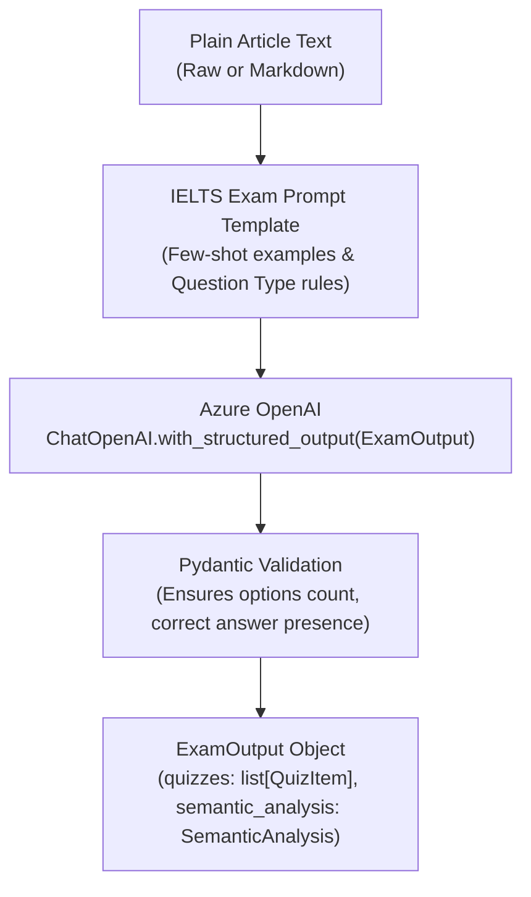

# Specialized Services: Quiz Generator & Linguistic Explainer

Beyond open-ended conversational agents, `ai_service/` hosts two dedicated, standalone generative engines tailored for English language acquisition:
1. **IELTS Quiz Generator** (`ai_service/quiz_generator/`)
2. **Contextual Linguistic Explainer** (`ai_service/explainer/`)

Both engines use **Pydantic-enforced structured outputs** (`with_structured_output`) to guarantee schema validity and eliminate JSON parsing failures.

---

## 1. IELTS Quiz Generator (`ai_service/quiz_generator/`)

### A. What It Does (Business & Functional Overview)
The Quiz Generator transforms any plain English article into a standardized IELTS-style reading comprehension test. It:
* Automatically formulates diverse question formats modeled after authentic IELTS Academic Reading exams.
* Generates detailed educational explanations and cites the exact supporting sentence from the text.
* Extracts high-level semantic metadata (summary, main idea, topic keywords, genre, and theme).

---

### B. How It Works (Technical Architecture)



#### Question Formats Generated
1. **Multiple Choice (`multiple_choice`):** 4 distinct options (A, B, C, D) targeting specific factual details, author intent, or tone. Distractors are crafted to be plausible yet demonstrably false based on the passage.
2. **Yes / No / Not Given (`yes_no_notgiven`):** Tests the candidate's ability to distinguish between verified claims (`YES`), contradicted claims (`NO`), and information unmentioned in the passage (`NOT GIVEN`).
3. **Fill In The Blank (`fill_in_blank`):** Summary completion exercises where students complete a paragraph using exact words from the passage, marked by tokens `[1]` through `[5]`.

#### Schema Specification (`schemas.py`)
```python
class QuizItem(BaseModel):
    quiz_type: str                  # "multiple_choice" | "yes_no_notgiven" | "fill_in_blank"
    question: str                   # Question prompt or summary with blanks
    options: list[str] | None       # 4 choices for MCQ, null for fill_in_blank
    correct_answer: str             # The exact correct answer string
    explanation: str                # Pedagogical rationale for the answer
    supporting_text: str            # Verbatim sentence from article confirming the answer
    source_chunk_ids: list[str]     # Chunk IDs associated with the question
    reading_skill: str              # e.g., "skimming", "scanning", "inference"

class SemanticAnalysis(BaseModel):
    keywords: list[str]             # 3-6 topic tags (e.g., ["Climate", "Antarctica"])
    summary: str                    # Concise 2-3 sentence summary
    main_idea: str                  # Central thesis statement
    genre: str                      # "scientific", "editorial", "historical"
    theme: str                      # Primary domain theme

class ExamOutput(BaseModel):
    quizzes: list[QuizItem]
    semantic_analysis: SemanticAnalysis
```

#### Sample Generated Quiz JSON
```json
{
  "semantic_analysis": {
    "keywords": ["Antarctica", "Ice Accumulation", "Atmospheric Rivers"],
    "summary": "East Antarctica experienced unprecedented snowfall due to inland atmospheric rivers, adding 695 billion tons of ice.",
    "main_idea": "Extreme meteorological events are temporarily reversing regional ice mass loss in East Antarctica.",
    "genre": "scientific",
    "theme": "Environment"
  },
  "quizzes": [
    {
      "quiz_type": "multiple_choice",
      "question": "What was the primary driver behind the record ice accumulation in East Antarctica?",
      "options": [
        "A sudden drop in global oceanic temperatures",
        "Moisture-laden atmospheric rivers penetrating inland",
        "Decreased solar radiation over the South Pole",
        "Reduced iceberg calving along the continental shelf"
      ],
      "correct_answer": "Moisture-laden atmospheric rivers penetrating inland",
      "explanation": "The text directly states that atmospheric rivers carrying warm, moist air were the primary cause of the record snowfall.",
      "supporting_text": "Researchers discovered that atmospheric rivers contributed over 70% of the anomalous precipitation.",
      "reading_skill": "detail_extraction"
    }
  ]
}
```

---

## 2. Contextual Linguistic Explainer (`ai_service/explainer/`)

### A. What It Does (Business & Functional Overview)
Generic online dictionaries fail when words have context-dependent meanings, specialized academic nuances, or domain-specific idioms. The **Contextual Explainer**:
* Evaluates words or phrases strictly within their **surrounding paragraph**.
* Provides a 1-sentence simplified summary, a detailed linguistic explanation, a plain English rewrite, and a breakdown of key sub-terms.
* Supports **real-time token streaming** for instant UI popovers when a user highlights text.

---

### B. How It Works (Technical Architecture)

The Explainer provides two execution pathways in `ai_service/explainer/explainer.py`:

```
User Highlights Phrase + Surrounding Paragraph
                      │
        ┌─────────────┴─────────────┐
        ▼                           ▼
[Static Structured Flow]    [Streaming Flow]
run_explained_flow()        stream_explained_tokens()
        │                           │
Structured Output           Real-time Token Stream
(Pydantic ExplainedOutput)  (Generator yielding strings)
        │                           │
Frontend Popover Detail     Instant Inline Reader Popup
```

#### 1. Structured Flow (`run_explained_flow`)
Uses `ChatOpenAI.with_structured_output(ExplainedOutput)` to enforce complete data models:

```python
class KeyTerm(BaseModel):
    term: str                       # Target sub-word
    meaning: str                    # Meaning in this specific paragraph

class ExplainedOutput(BaseModel):
    phrase: str                     # The queried text
    summary: str                    # 1-sentence contextual summary
    detailed_explanation: str       # Deep dive into tone, nuance, and connotation
    simplified_version: str         # CEFR A2/B1 level plain English rewrite
    key_terms: list[KeyTerm]        # Vocabulary breakdowns
```

#### Sample Explainer JSON Output
```json
{
  "phrase": "unprecedented atmospheric rivers",
  "summary": "Massive corridors of concentrated water vapor in the sky that are larger and more intense than ever previously recorded.",
  "detailed_explanation": "In meteorology, 'atmospheric rivers' are narrow regions in the atmosphere that transport horizontal moisture. 'Unprecedented' emphasizes that historical satellite and weather station records have never documented events of this magnitude over East Antarctica.",
  "simplified_version": "Record-breaking sky rivers carrying huge amounts of rain and snow.",
  "key_terms": [
    {
      "term": "unprecedented",
      "meaning": "Never done or known before; completely novel in historical records."
    },
    {
      "term": "atmospheric rivers",
      "meaning": "Long, flowing columns of condensed water vapor in the sky."
    }
  ]
}
```

#### 2. Streaming Flow (`stream_explained_tokens`)
When the user wants instant reading assistance without waiting for full JSON compilation, `stream_explained_tokens(phrase, context)` streams Markdown text tokens directly from the model using prompt-engineered bullet points.

---

## 3. Reliability & Validation Safeguards

| Failure Mode | Mitigation Mechanism |
| :--- | :--- |
| **Malformed LLM JSON syntax** | `with_structured_output` relies on OpenAI's native tool-calling/JSON-schema mode, preventing raw string parsing errors. |
| **Pydantic Validation Error** | `generator.py` wraps the model call in a retry loop; if schema validation fails, it re-invokes with temperature adjustments. |
| **Ambiguous Vocabulary Queries** | If `paragraph_context` is omitted, the prompt analyzes the phrase using its most common academic meaning while explicitly noting the absence of surrounding context. |
