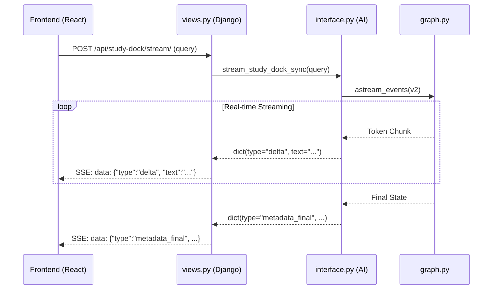

# Backend (Django & Django Ninja)

## 1. Overview
The Backend (`ReadAndQues/`) is a Django monolith that serves as the API Gateway for the platform. It acts as the bridge connecting the React frontend, the AI Service, and the persistent storage databases.

## 2. Key Responsibilities
*   **Authentication & Authorization**: Session and Token management for secure access.
*   **Database Interactions**: Exposes clean APIs for the frontend to access processed Gold articles from MongoDB.
*   **AI Streaming (SSE)**: Wraps the AI Service generators into Django `StreamingHttpResponse` to deliver real-time typing effects to the frontend.

## 3. Request Lifecycle (Study Dock Streaming)

## 4. Key Directories & Files
*   **`ReadAndQues/readspace/views.py`**: Standard Django views managing page renders and specialized Server-Sent Event (SSE) streaming endpoints (e.g., `study_dock_stream_api`).
*   **`ReadAndQues/readspace/api/router.py`**: REST API endpoints built using **Django Ninja** for type-safe, fast API development (e.g., `/search/semantic/`).
*   **`ReadAndQues/service/services.py`**: The business logic layer. Keeps Django views thin by handling orchestrations like saving highlights or coordinating article deletion.
*   **`ReadAndQues/service/infrastructure/`**: Repository pattern adapters connecting Django to MongoDB, MinIO, and ChromaDB.

## 5. Recent Architectural Changes
Legacy RAG pipelines (such as the old synchronous `ask_question`) and fake streaming endpoints (`rag_stream_api`) have been completely removed to reduce technical debt. The backend now strictly utilizes the modern, real-time multi-agent `study_dock_stream_api`.
