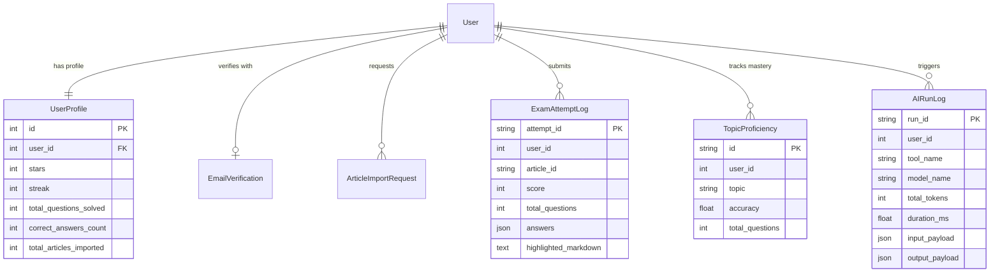

# Architecture & Data Models (Polyglot Persistence)

The backend employs a **Polyglot Persistence** architecture, dividing data storage between **PostgreSQL (Relational ORM)** for strictly transactional and analytical records, and **MongoDB (Document Store)** for semi-structured text and educational quizzes.

---

## 1. Relational Data Models (PostgreSQL / SQLite)

Relational models are managed via standard Django ORM migrations located in `accounts/models.py` and `service/models.py`.



---

### A. `accounts.UserProfile` (User Gamification & Analytics)
Stores personalized state, learning metrics, and the star economy balance:

| Field Name | Type | Constraints | Description |
| :--- | :--- | :--- | :--- |
| `user` | `OneToOneField` | `on_delete=CASCADE` | Link to Django's core `auth_user` |
| `avatar_url` | `URLField` | Nullable | Profile picture URL |
| `stars` | `PositiveIntegerField`| Default: 10 (Prod) / 100 (Dev)| Currency used to import custom articles |
| `streak` | `PositiveIntegerField`| Default: 0 | Consecutive daily login streak count |
| `total_questions_solved` | `PositiveIntegerField`| Default: 0 | Cumulative questions answered |
| `correct_answers_count` | `PositiveIntegerField`| Default: 0 | Cumulative correct answers |
| `total_articles_imported` | `PositiveIntegerField`| Default: 0 | Count of articles imported via URL |
| `login_days_count` | `PositiveIntegerField`| Default: 0 | Total distinct active days |

---

### B. `service.AIRunLog` (AI Invocation Audit Ledger)
Provides complete observability and auditability for all LLM and agent operations:

```python
class AIRunLog(models.Model):
    run_id = models.CharField(max_length=64, primary_key=True, default=uuid.uuid4)
    user_id = models.IntegerField(null=True, blank=True)
    tool_name = models.CharField(max_length=64)        # e.g., "study_dock", "quiz_generator"
    tool_version = models.CharField(max_length=32)
    model_name = models.CharField(max_length=64, default="azure_gpt")
    status = models.CharField(max_length=32, default="completed") # "completed" | "failed"
    prompt_tokens = models.IntegerField(default=0)
    completion_tokens = models.IntegerField(default=0)
    total_tokens = models.IntegerField(default=0)
    duration_ms = models.FloatField(default=0.0)
    input_payload = models.JSONField(default=dict, blank=True)
    output_payload = models.JSONField(default=dict, blank=True)
    error_message = models.TextField(blank=True, default="")
    created_at = models.DateTimeField(auto_now_add=True)
```

---

### C. `service.ExamAttemptLog` (Exam Submission Records)
Records every practice test submitted by a student:
* `attempt_id`: Unique UUID.
* `user_id`: ID of the student.
* `article_id`: Target article ID.
* `score`: Number of correct answers achieved.
* `total_questions`: Total questions in the test.
* `answers`: JSON map of user submissions: `{"0": "Yes", "1": "river | snow"}`.
* `highlighted_markdown`: Preserves the exact text highlighting markers made by the student during the test.

---

### D. `service.TopicProficiency` (Topic Mastery Tracking)
Tracks user accuracy per academic IELTS topic (e.g. Science, Technology, Environment):
* `unique_together = ("user_id", "topic")`
* `accuracy`: Calculated as `correct_answers / total_questions`. Used to render the student's proficiency radar chart.

---

## 2. Document Data Models (MongoDB)

Defined via Pydantic schemas in `readspace/models.py`, these models govern documents stored in MongoDB's `articlesDB.articles` and `articlesDB.gold_content` collections.

### A. `QuizItem` Schema
Represents a single reading comprehension question:

```python
class QuizItem(BaseModel):
    quiz_type: str = Field(..., description="'multiple_choice', 'yes_no_not_given', or 'fill_in_blank'")
    question: str = Field(..., description="The prompt or summary paragraph containing [1]..[5]")
    options: list[str] | None = Field(default=None, description="Options for MCQ, or null")
    correct_answer: str = Field(..., description="Correct text or answers separated by ' | '")
    explanation: str | None = Field(default="", description="Pedagogical explanation")
    supporting_text: str | None = Field(default="", description="Verbatim sentence proving the answer")
    reading_skill: str | None = Field(default=None, description="'inference', 'detail', 'main_idea', etc.")
```

---

### B. `ArticleMongoModel` (Primary Article Document)
Represents the complete article payload stored in MongoDB:

```python
class ArticleMongoModel(BaseModel):
    id: str | None = Field(default=None, alias="_id")
    url: str = Field(..., description="Original article URL")
    title: str = Field(..., description="Article title")
    original_text: str = Field(..., description="Raw crawled body text")
    html_content: str | None = Field(default=None, description="Raw HTML for reader view")
    clean_text: str | None = Field(default=None, description="Sanitized Markdown text")
    source_name: str | None = Field(default="Unknown", description="Source publisher")
    
    # Generated Quizzes & Exams
    quizzes: list[QuizItem] = Field(default_factory=list)
    exams: list[dict[str, Any]] = Field(default_factory=list)
    
    # Metadata & Taxonomy
    theme: str | None = Field(default=None, description="Domain theme (e.g. Science)")
    genre: str | None = Field(default=None, description="Text genre (e.g. scientific)")
    image_url: str | None = Field(default=None, description="Hero image URL")
    status: str = Field(default="completed", description="Status flag")
    created_at: datetime = Field(default_factory=datetime.utcnow)
```

#### Sample MongoDB Document (`gold_content`)
```json
{
  "_id": "art_b63f7920e6650b13",
  "url": "https://www.sciencedaily.com/releases/2026/09/260906101520.htm",
  "title": "Antarctica gained a record 695 billion tons of ice",
  "theme": "Environment",
  "genre": "scientific",
  "image_url": "https://sciencedaily.com/images/2026/09/ice_core.jpg",
  "clean_text": "### Surprising Ice Accumulation\n\nEast Antarctica experienced record-breaking snowfall...",
  "quizzes": [
    {
      "quiz_type": "multiple_choice",
      "question": "What caused the unprecedented ice gain in East Antarctica?",
      "options": ["Ocean currents", "Atmospheric rivers", "Decreased sunlight", "Volcanic activity"],
      "correct_answer": "Atmospheric rivers",
      "explanation": "The passage confirms atmospheric rivers carried unprecedented moisture inland.",
      "supporting_text": "Atmospheric rivers contributed over 70% of the anomalous snowfall."
    }
  ]
}
```
