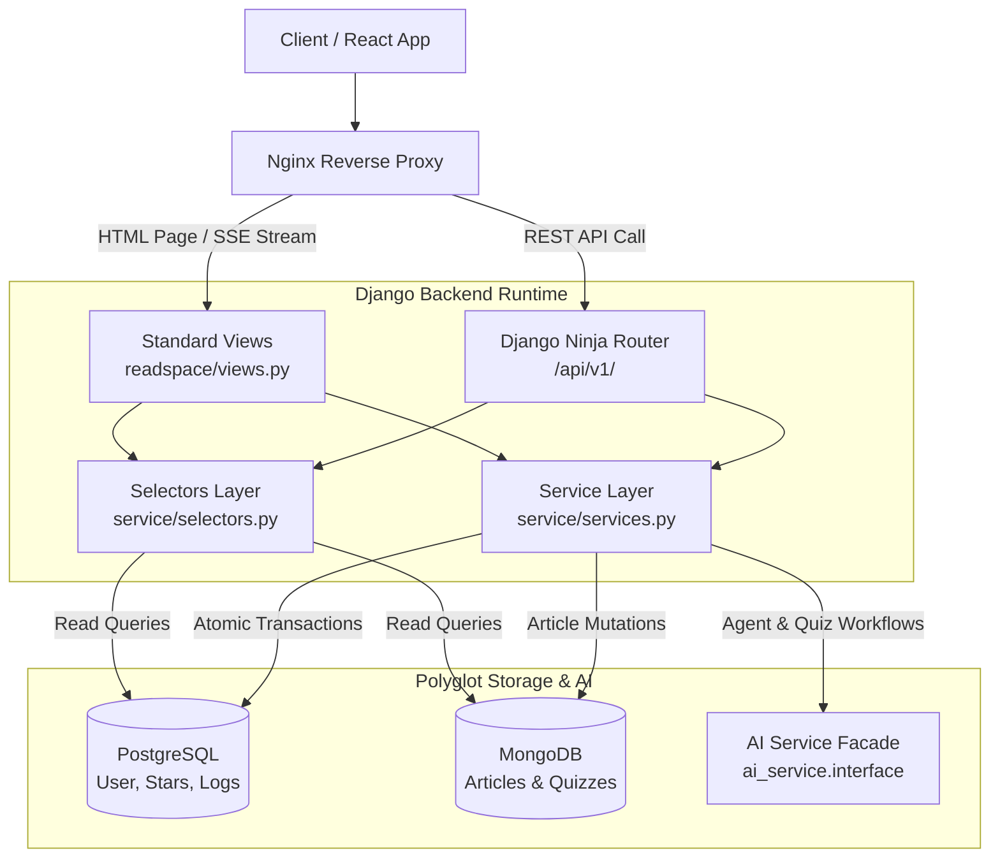

# Backend Architecture Overview

The **Backend** (`ReadAndQues/`) is a modular Django application acting as the centralized **API Gateway, Business Orchestrator, and Authentication Provider** for the ReadAndQues platform. It coordinates interactions between the React frontend, the decoupled AI Service, and four specialized persistence systems.

---

## 1. System Architecture & Design Philosophy

```
┌────────────────────────────────────────────────────────────────────────┐
│                        Client Tier (React Frontend)                    │
└───────────────────────────────────┬────────────────────────────────────┘
                                    │ HTTP / REST / SSE
                                    ▼
┌────────────────────────────────────────────────────────────────────────┐
│                         Nginx Reverse Proxy                            │
│           (Static assets, TLS termination, SSE unbuffered proxy)       │
└───────────────────────────────────┬────────────────────────────────────┘
                                    │ WSGI
                                    ▼
┌────────────────────────────────────────────────────────────────────────┐
│                     Gunicorn + Django Monolith                         │
│  ┌───────────────────────┬──────────────────────────────────────────┐  │
│  │ Django Ninja API      │ Traditional Views                        │  │
│  │ [MODERN] (/api/v1/)   │ [MAINTAINED] (HTML Pages & SSE Stream)   │  │
│  └───────────┬───────────┴─────────────────────┬────────────────────┘  │
│              ▼                                 ▼                       │
│  ┌──────────────────────────────────────────────────────────────────┐  │
│  │ Service & Domain Layer (services.py, selectors.py, adapters.py)  │  │
│  └───────────────────┬─────────────────────────┬────────────────────┘  │
└──────────────────────┼─────────────────────────┼───────────────────────┘
                       │                         │
                       ▼                         ▼
         ┌──────────────────────────┐ ┌──────────────────────────────────┐
         │ Polyglot Persistence     │ │ AI Service Facade                │
         │ - PostgreSQL (Relational)│ │ (ai_service.interface)           │
         │ - MongoDB (Articles/Quiz)│ │ - Multi-Agent Study Dock         │
         │ - ChromaDB (Vectors)     │ │ - Hybrid RAG Engine              │
         │ - MinIO (S3 Blobs/Models)│ │ - IELTS Quiz & Explainer         │
         └──────────────────────────┘ └──────────────────────────────────┘
```

The backend is built around three foundational design tenets:
1. **Clean Service Layer (Domain-Driven):** Views and API endpoints remain thin HTTP controllers. Core business logic (star economy deductions, exam grading, article imports) is encapsulated in `service/services.py`, while read queries are isolated in `service/selectors.py`.
2. **Strict AI Decoupling:** The backend never imports LangChain or LangGraph. It communicates exclusively through the public boundary in `ai_service.interface`.
3. **Polyglot Persistence:** No single database fits all requirements. Relational transactions, semi-structured text, vector embeddings, and object storage are distributed across specialized engines.

---

## 2. Polyglot Persistence Strategy (Why 4 Databases?)

| Database System | Engine & Driver | Managed By | Contents & Responsibilities |
| :--- | :--- | :--- | :--- |
| **PostgreSQL / SQLite** | Relational ORM (`django.db`) | Django Migrations | Users, profiles, star balances, streaks, exam submission attempts, AI token usage ledger (`AIRunLog`). |
| **MongoDB** | Document Store (`pymongo`) | `service/infrastructure/` | Raw articles, cleaned text, IELTS quiz collections, semantic tags (`articlesDB.gold_content`). |
| **ChromaDB** | Vector DB (`chromadb`) | `ai_service.interface` | 800-character text embeddings for semantic k-NN search (`gold_semantic_chunks`). |
| **MinIO** | S3 Object Store (`minio`) | `service/infrastructure/` | Cold HTML page archives, sanitized JSON backups, and serialized BM25 Okapi model artifacts. |

---

## 3. Legacy vs. Modern Architecture Matrix

To prevent confusion when navigating the codebase, use this reference matrix to identify modern standards versus maintained legacy components:

| Functional Area | 🟡 Legacy / Compatibility `[LEGACY]` | 🟢 Modern Production Standard `[MODERN]` | Technical Rationale |
| :--- | :--- | :--- | :--- |
| **REST API Layer** | Traditional Django Template Views returning ad-hoc JSON | **Django Ninja OpenAPI Router (`/api/v1/`)** | Strict Pydantic type safety, automated Swagger/OpenAPI docs, faster execution. |
| **AI Reading Assistant** | Monolithic synchronous `ask_question` function | **Multi-Agent `study_dock_stream_api`** | Native token streaming via SSE, LangGraph intent classification, checkpointer memory. |
| **Search Endpoints** | Disconnected `/api/search/keyword/` & `/api/search/semantic/` | **Unified Hybrid RAG (`/search/hybrid/`)** | Combines Dense Vector + Sparse BM25 via Reciprocal Rank Fusion (RRF) and Cross-Encoder reranking. |
| **Text Highlighting** | Dict payloads keyed by `"highlights"` | **Standardized Markdown `highlighted_text`** | Preserves persistent highlight coordinates across different client devices and views. |
| **Exam Triggering** | Asynchronous status polling (`status/<id>/`) | **Direct On-Demand Generation via Interface** | Eliminates race conditions and polling lag during article practice. |

---

## 4. End-to-End Request Flow



---

## 5. Directory Structure Guide

```
ReadAndQues/
├── ReadAndQues/                 # Django project configuration
│   ├── settings/                # Base, local, and production settings
│   ├── urls.py                  # Root URL dispatcher
│   ├── wsgi.py                  # WSGI entry point for Gunicorn
│   └── asgi.py                  # ASGI entry point
├── accounts/                    # Authentication, security & user profiles
│   ├── backends.py              # Custom UsernameOrEmailBackend (anti-timing attack)
│   ├── emails.py                # OTP email delivery (Resend API)
│   ├── models.py                # UserProfile, EmailVerification
│   ├── urls.py                  # /login/, /register/, /profile/
│   └── views.py                 # Anti-bot verification & auth controllers
├── readspace/                   # Core reading space & interactive learning
│   ├── api/                     # Django Ninja REST API router and schemas
│   ├── models.py                # Pydantic schemas for MongoDB articles & quizzes
│   ├── urls.py                  # HTML view routes and SSE stream paths
│   └── views.py                 # Page renderers & study_dock_stream_api (SSE)
├── service/                     # Central domain services and database adapters
│   ├── infrastructure/          # Repository adapters for MongoDB, MinIO, ChromaDB
│   ├── models.py                # PostgreSQL ORM: AIRunLog, ExamAttemptLog, TopicProficiency
│   ├── selectors.py             # Pure read abstractions
│   └── services.py              # Business logic & transactional mutations
├── homepage/                    # Landing page and browsing views
└── manage.py                    # Django CLI management utility
```
