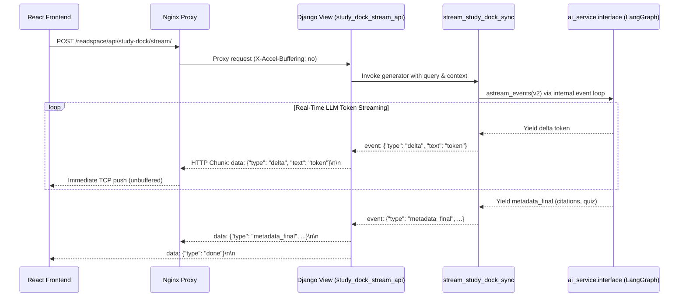

# Real-Time Streaming & Server-Sent Events (SSE)

The backend provides instantaneous, token-by-token streaming for the AI Study Dock using **Server-Sent Events (SSE)**. This guide documents the streaming endpoint architecture, the synchronous-to-asynchronous generator bridge, and Nginx/Gunicorn buffer configuration.

---

## 1. What It Does (Business & User Experience Overview)

When interacting with the AI Study Dock (asking questions, requesting vocabulary definitions, or generating quizzes):
* Waiting 5–10 seconds for an LLM to generate an entire 500-word response produces high perceived latency and poor user engagement.
* **Real-time token streaming** displays tokens immediately as they are generated by the model (within 200–400ms of the user hitting Enter).
* Emits structured lifecycle events (`metadata` → `delta` → `metadata_final` → `done`) so the React frontend can simultaneously render typing animations, citations, and quiz cards.

---

## 2. How It Works (Architectural & Technical Deep Dive)

The streaming controller is implemented in `ReadAndQues/readspace/views.py` (`study_dock_stream_api`).



---

### Step-by-Step Execution Mechanics

#### 1. Request Handling & Context Extraction
The client sends a POST request with JSON payload:
```json
{
  "query": "What are atmospheric rivers?",
  "article_id": "art_b63f7920e6650b13",
  "page_context": "readspace",
  "article_text": "East Antarctica experienced unprecedented...",
  "thread_id": "session_thread_9812"
}
```

#### 2. The WSGI Synchronous Bridge
Django runs primarily under WSGI (Gunicorn with `gthread` workers). Running an async generator inside a synchronous WSGI worker can trigger thread lockups.
To solve this, `ai_service.interface` exports `stream_study_dock_sync()`:
```python
def stream_study_dock_sync(...) -> Generator[dict[str, Any]]:
    loop = asyncio.new_event_loop()
    async_gen = stream_study_dock(...)
    try:
        while True:
            try:
                event = loop.run_until_complete(async_gen.__anext__())
                yield event
            except StopAsyncIteration:
                break
    finally:
        loop.close()
```
The generator runs its own dedicated event loop, pulls each token asynchronously from LangGraph's `astream_events(v2)`, and yields it synchronously to Django.

#### 3. SSE Packaging via `StreamingHttpResponse`
In `readspace/views.py`, the generator is wrapped in Django's `StreamingHttpResponse`:

```python
def sse_event_stream():
    for event in stream_study_dock_sync(query=query, ...):
        yield f"data: {json.dumps(event)}\n\n"

response = StreamingHttpResponse(
    sse_event_stream(),
    content_type="text/event-stream"
)
response["Cache-Control"] = "no-cache"
response["X-Accel-Buffering"] = "no"
return response
```

---

## 3. SSE Protocol & Event Specifications

Every event follows the standard W3C Server-Sent Events protocol: `data: <JSON-string>\n\n`.

### Event Types
1. **`metadata` (Initial Metadata):**
   ```json
   {
     "type": "metadata",
     "intent": "general",
     "action_type": "chat"
   }
   ```
2. **`delta` (Streamed Tokens):**
   ```json
   {
     "type": "delta",
     "text": " atmospheric"
   }
   ```
3. **`metadata_final` (Execution Complete):**
   ```json
   {
     "type": "metadata_final",
     "response": "Atmospheric rivers are long, narrow regions...",
     "citations": [
       {
         "article_id": "art_b63f7920e6650b13",
         "title": "Antarctica gained a record...",
         "url": "https://..."
       }
     ],
     "quiz_data": [],
     "action_type": "chat",
     "intent": "general"
   }
   ```
4. **`done` (Stream Terminator):**
   ```json
   {
     "type": "done"
   }
   ```

---

## 4. Production Buffering Safeguards (Nginx & Gunicorn)

A common bug in SSE streaming is that tokens appear in one single burst at the end rather than streaming smoothly. This is caused by **reverse proxy buffer caching**.

### The Solution:
1. **Django Header:** The response explicitly sets `response["X-Accel-Buffering"] = "no"`. This instructs Nginx to bypass its internal 4KB/8KB proxy buffer.
2. **Nginx Configuration:**
   ```nginx
   location /readspace/api/study-dock/stream/ {
       proxy_pass http://backend:8000;
       proxy_http_version 1.1;
       proxy_set_header Connection "";
       proxy_buffering off;
       proxy_cache off;
       chunked_transfer_encoding on;
   }
   ```
3. **Gunicorn Worker Class:** For streaming setups, Gunicorn must be run with the `gthread` worker class:
   ```bash
   gunicorn ReadAndQues.wsgi:application --workers 4 --threads 4 --worker-class gthread
   ```
