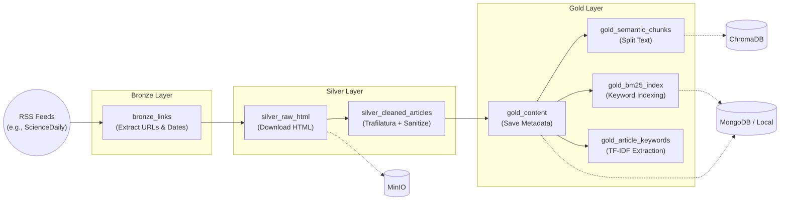

# Data Pipeline (Dagster ETL)

## 1. Overview
The Data Pipeline (`NewsPipeline/`) is responsible for discovering, downloading, cleaning, and indexing news articles. It is robustly orchestrated by **Dagster** using a Medallion Architecture pattern (Bronze, Silver, Gold).

## 2. Medallion Architecture


## 3. Key Directories & Files
*   **`NewsPipeline/src/NewsPipeline/definitions.py`**: The main registry for Dagster, exporting the `defs` object containing all assets, jobs, schedules, and resources.
*   **`NewsPipeline/src/NewsPipeline/assets/silver.py`**: Contains the critical `sanitize_article_text()` function. It uses `trafilatura` to strip HTML boilerplate, followed by custom logic to clean up footers and standardize Markdown headings.
*   **`NewsPipeline/src/NewsPipeline/assets/gold.py`**: Handles text chunking using LangChain's `RecursiveCharacterTextSplitter` and initiates database indexing (ChromaDB semantic vectors and BM25 keywords).
*   **`NewsPipeline/src/NewsPipeline/resources/`**: Custom IO Managers (e.g., `MinioIOManager`, `MongoIOManager`) ensuring seamless integration between Dagster assets and physical storage layers.

## 4. How to Run & Monitor
To launch the Dagster UI locally and monitor the ETL DAG:
```bash
cd NewsPipeline
source .venv/bin/activate
dagster dev
```
Navigate to `http://localhost:3000` to inspect assets, view lineage, and manually trigger the `daily_news_job` schedule.
