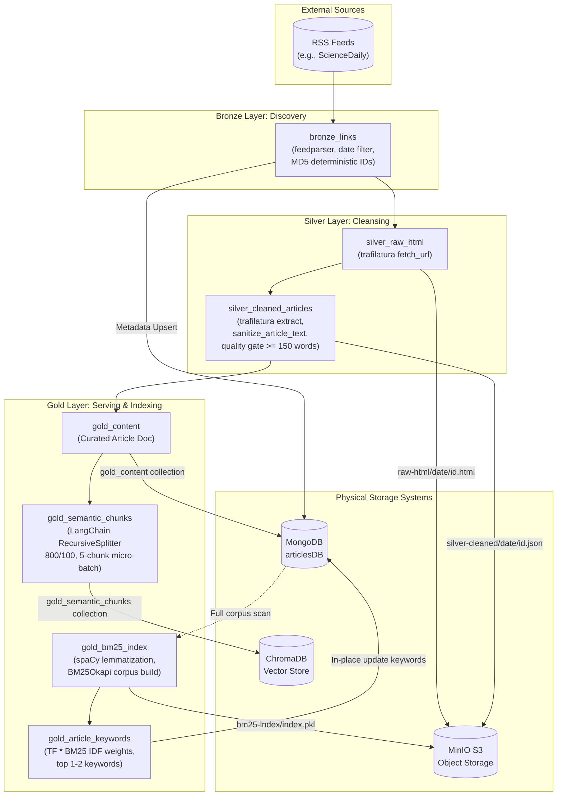

# Data Pipeline Overview

The **Data Pipeline** (`NewsPipeline/`) is an automated, production-grade ETL and indexing system orchestrated by **Dagster**. It continuously discovers, ingests, sanitizes, and indexes news articles using the **Medallion Architecture** pattern (Bronze → Silver → Gold).

---

## 1. Architectural Philosophy: Medallion Design

The pipeline separates data processing into three distinct stages to ensure fault tolerance, idempotency, and auditability:

```
External RSS Feeds
       │
       ▼
┌─────────────────────────────────────────────────────────────┐
│ BRONZE LAYER (Ingestion)                                    │
│ - Scan feeds, normalize dates, generate deterministic IDs    │
│ - Raw discovery metadata saved to MongoDB                   │
└──────────────────────────────┬──────────────────────────────┘
                               │
                               ▼
┌─────────────────────────────────────────────────────────────┐
│ SILVER LAYER (Sanitization & Standardization)               │
│ - Raw HTML byte backup stored in MinIO                      │
│ - Text extraction & custom regex boilerplate removal        │
│ - Quality gate: enforce >= 150 words                        │
│ - Clean structured JSON stored in MinIO                     │
└──────────────────────────────┬──────────────────────────────┘
                               │
                               ▼
┌─────────────────────────────────────────────────────────────┐
│ GOLD LAYER (Indexing & Enrichment)                          │
│ - Curated document metadata saved to MongoDB                │
│ - Semantic chunking (800 chars / 100 overlap) → ChromaDB    │
│ - Full-corpus BM25 lexical index build → MinIO              │
│ - In-place TF-IDF article keyword extraction → MongoDB      │
└─────────────────────────────────────────────────────────────┘
```

### Why This Separation?
1. **Raw Immutability (Bronze/Silver Raw):** Raw HTML and feed records are preserved byte-for-byte in MinIO and MongoDB. If parsing or chunking logic changes in the future, the entire corpus can be reprocessed without re-scraping external sites.
2. **Quality Isolation (Silver Clean):** Dirty web markup, paywall banners, and stubs (< 150 words) are filtered before costly downstream operations (vectorization, LLMs).
3. **Multi-Modal Storage (Gold):** Downstream applications (search engines, RAG pipelines, frontend web app) require different query patterns:
   - **Document Lookup:** MongoDB for fast key-value and metadata filtering.
   - **Semantic Vector Search:** ChromaDB for cosine/dense embedding similarity.
   - **Lexical Search:** MinIO-stored BM25 Okapi index for keyword retrieval.

---

## 2. End-to-End Data Flow



---

## 3. Storage Architecture Matrix

| Storage System | Component / Bucket / Collection | Role & Contents | Access Pattern |
| :--- | :--- | :--- | :--- |
| **MongoDB** | Collection: `bronze_links` | Candidate article URLs and discovery dates | Write-heavy upserts, partition-filtered reads |
| **MongoDB** | Collection: `gold_content` | Curated articles with title, clean text, word count, keywords, theme | Primary OLTP datastore for the web application |
| **MinIO** | Bucket: `raw-html` | Unmodified HTML documents (`<date>/<article_id>.html`) | Write-once archive, cold storage |
| **MinIO** | Bucket: `silver-cleaned` | Sanitized article JSON (`<date>/<article_id>.json`) | Intermediate staging format |
| **MinIO** | Bucket: `bm25-index` | Serialized BM25 Okapi model (`gold_bm25_index/index.pkl`) | Batch model export, read during search |
| **ChromaDB** | Collection: `gold_semantic_chunks` | 800-character semantic text chunks + embeddings + metadata | Vector similarity search (k-NN) |

---

## 4. Execution & Orchestration Model

The pipeline runs on **Dagster** with a partition-aware model:

* **Daily Partitioning:** Assets (`bronze_links`, `silver_raw_html`, `silver_cleaned_articles`, `gold_content`, `gold_semantic_chunks`) use `DailyPartitionsDefinition` (`YYYY-MM-DD`, UTC). A single run operates on one discrete day's partition.
* **Corpus-Level Unpartitioned Assets:** `gold_bm25_index` and `gold_article_keywords` execute across the whole corpus to build global term statistics.
* **Single-Process Execution (`in_process_executor`):** Configured in `NewsPipeline/jobs.py` to run asset steps sequentially inside the container. This prevents concurrent child process forks from causing PyTorch/tokenizer memory spikes (avoiding Docker OOM `SIGKILL`).
* **Automated Schedule:** `daily_news_schedule` triggers `daily_news_job` at the end of each UTC day.

---

## 5. Directory Structure

```
NewsPipeline/
├── dagster_home/                # Dagster instance configs & workspace definition
│   ├── dagster.yaml
│   └── workspace.yaml
├── src/
│   └── NewsPipeline/
│       ├── __init__.py
│       ├── definitions.py       # Dagster registry (assets, jobs, schedules, resources)
│       ├── jobs.py              # daily_news_job & reindex_job definitions
│       ├── partitions.py        # Daily partition & deterministic hashing utilities
│       ├── rss_feeds.txt        # Configured active RSS feed URLs
│       ├── sensors.py           # Pipeline sensors
│       ├── assets/
│       │   ├── bronze.py        # Feed ingestion & discovery
│       │   ├── silver.py        # HTML download & text sanitization
│       │   └── gold.py          # Chunking, vector indexing & BM25 extraction
│       └── resources/
│           ├── bm25_resource.py    # BM25Okapi training & MinIO pickle persistence
│           ├── chroma_resource.py  # ChromaDB client & micro-batched upsert
│           ├── minio_io_manager.py # MinIO S3 client & bucket management
│           ├── mongo_io_manager.py # MongoDB IO Manager & fallback logic
│           └── rss_resource.py     # Feedparser reader & multi-format thumbnail extractor
├── Dockerfile.dagster           # Webserver and Daemon container
├── Dockerfile.user_code         # gRPC Code Server container
└── pyproject.toml               # Python dependencies (managed via uv)
```
