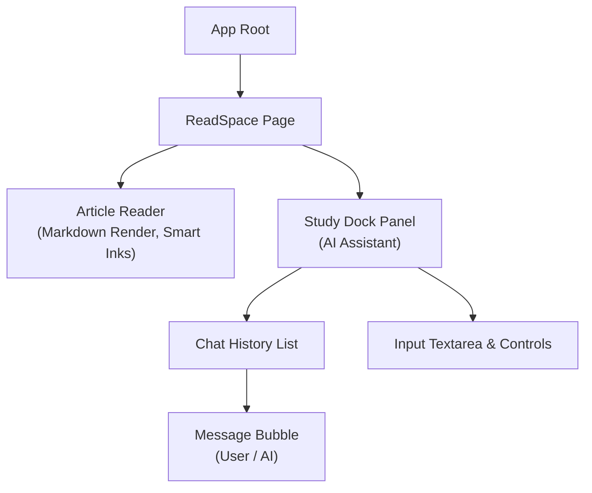

# Frontend (React + Vite)

## 1. Overview
The Frontend (`frontend/`) is a fast, responsive Single Page Application (SPA) built with **React 18**, **TypeScript**, and **Vite**, heavily styled using **Tailwind CSS**. 

## 2. Architecture & State Management
*   **Routing**: Standard SPA routing mapped to backend entry points.
*   **Styling**: Utility-first CSS using Tailwind. Components are highly modular and responsive.
*   **Streaming Consumption**: A standout feature of the frontend is parsing Server-Sent Events (SSE) natively using the Fetch API.

## 3. UI Component Hierarchy (Study Dock)

## 4. Server-Sent Events (SSE) Processing
A critical capability of the frontend is rendering AI responses in real-time. It connects to the Django backend using the standard `fetch()` API and processes the stream via a `ReadableStreamReader`.

**Event Protocol Handling:**
*   `metadata`: Initial configuration data (e.g., citations, identified intent).
*   `delta`: Text chunks representing the AI's response, appended directly to the active message's state.
*   `metadata_final`: The finalized state (e.g., generated quizzes, resolved citations).
*   `[DONE]` / `done`: Signal to safely close the stream connection.

## 5. Key Directories & Scripts
*   **`frontend/src/components/`**: Reusable UI components (Buttons, Modals, Markdown Renderers).
*   **`frontend/src/hooks/`**: Custom React hooks encapsulating complex logic (e.g., `useStudyDockStream` for managing SSE states and chunk merging).
*   **`frontend/src/pages/`**: Top-level route containers defining the main views (Homepage, ReadSpace).
*   **`frontend/package.json`**: Key commands include `npm run dev` (local Vite server) and `npm run build` (TypeScript compilation + production bundle).
