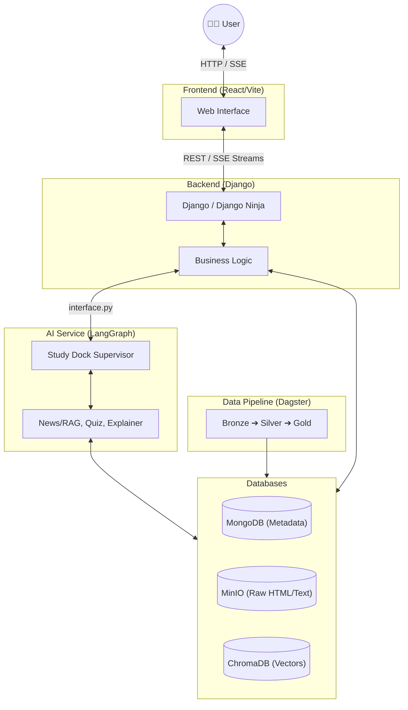

# ReadAndQues - System Architecture Overview

## 1. Introduction
ReadAndQues is an interactive, AI-powered reading and learning platform. It automatically ingests news articles, processes them using a Medallion data architecture, and provides a rich interactive reading environment (Study Dock) powered by a multi-agent LLM system.

## 2. High-Level Architecture

## 3. Key Components
1. **[Data Pipeline](./data_pipeline.md)**: Dagster-based ETL that pulls RSS feeds, sanitizes text, and indexes semantic chunks.
2. **[AI Service](./ai_service.md)**: LangGraph multi-agent system (Study Dock) providing conversational RAG, quiz generation, and in-context vocabulary explanations.
3. **[Backend](./backend.md)**: Django monolith acting as the API gateway, managing users, auth, and piping streaming responses (SSE).
4. **[Frontend](./frontend.md)**: React SPA built with Vite and Tailwind CSS.
